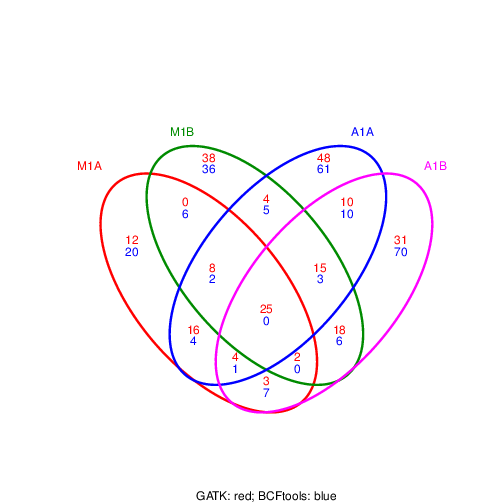

```{css, echo=FALSE}
pre code {
white-space: pre !important;
overflow-x: scroll !important;
word-break: keep-all !important;
word-wrap: initial !important;
}
```

<!--
- Compile from command-line
Rscript -e "rmarkdown::render('systemPipeVARseq.Rmd', c('BiocStyle::html_document'), clean=F); knitr::knit('systemPipeVARseq.Rmd', tangle=TRUE)"; Rscript ../md2jekyll.R systemPipeVARseq.knit.md 14; Rscript -e "rmarkdown::render('systemPipeVARseq.Rmd', c('BiocStyle::pdf_document'))"
-->

```{r style, echo = FALSE, results = 'asis'}
BiocStyle::markdown()
options(width=60, max.print=1000)
knitr::opts_chunk$set(
    eval=as.logical(Sys.getenv("KNITR_EVAL", "TRUE")),
    cache=as.logical(Sys.getenv("KNITR_CACHE", "TRUE")), 
    tidy.opts=list(width.cutoff=60), tidy=TRUE)
```

```{r setup, echo=FALSE, messages=FALSE, warnings=FALSE, eval=FALSE}
suppressPackageStartupMessages({
    library(systemPipeR)
    library(BiocParallel)
    library(Biostrings)
    library(Rsamtools)
    library(GenomicRanges)
    library(ggplot2)
    library(GenomicAlignments)
    library(ShortRead)
    library(ape)
    library(batchtools)
})
```

# Introduction

Users want to provide here background information about the design of their VAR-Seq project.

## Background and objectives

This report describes the analysis of a VAR-Seq project studying the
genetic differences among several strains ... from *organism* ....

## Experimental design

Typically, users want to specify here all information relevant for the
analysis of their NGS study. This includes detailed descriptions of
FASTQ files, experimental design, reference genome, gene annotations,
etc.

# Workflow environment

## Generate workflow environment

Load workflow environment with sample data into your current working
directory. The sample data are described
[here](http://www.bioconductor.org/packages/devel/bioc/vignettes/systemPipeR/inst/doc/systemPipeR.html#load-sample-data-and-workflow-templates).

```{r genVAR_workflow, eval=FALSE}
library(systemPipeRdata)
genWorkenvir(workflow="varseq")
setwd("varseq")
```

Alternatively, this can be done from the command-line as follows:

```{sh genVar_workflow_command_line, eval=FALSE}
Rscript -e "systemPipeRdata::genWorkenvir(workflow='varseq')"
```

In the workflow environments generated by `genWorkenvir` all data inputs are stored in
a `data/` directory and all analysis results will be written to a separate
`results/` directory, while the `systemPipeVARseq.Rmd` script and the `targets` file are expected to be located in the parent directory. The R session is expected to run from this parent
directory. Additional parameter files are stored under `param/`.

To work with real data, users want to organize their own data similarly
and substitute all test data for their own data. To rerun an established
workflow on new data, the initial `targets` file along with the corresponding
FASTQ files are usually the only inputs the user needs to provide.

## Run workflow

Now open the R markdown script `systemPipeVARseq.Rmd`in your R IDE (_e.g._ vim-r or RStudio) and 
run the workflow as outlined below. 

Here pair-end workflow example is provided. Please refer to the main vignette 
`systemPipeR.Rmd` for running the workflow with single-end data. 

### Run R session on computer node

In a computer cluster enviornment. Typically, after opening the `Rmd` file of 
this workflow in Vim and attaching a connected R session via the `F2` ( vim-r 
plugin installed) key, following command sequence can be used to run your R
session on a computer node.

```{r closeR, eval=FALSE}
q("no") # closes R session on head node
```

```{bash node_environment, eval=FALSE}
srun --x11 --partition=short --mem=2gb --cpus-per-task 4 --ntasks 1 --time 2:00:00 --pty bash -l
module load R/3.6.0
R
```

Now check your R session running environment.

```{r r_environment, eval=FALSE}
system("hostname") # should return the computer name or cluster name
getwd() # checks current working directory of R session
dir() # returns content of current working directory
```

The `systemPipeR` package needs to be loaded to perform the analysis steps shown in
this report [@H_Backman2016-bt].

```{r load_systempiper, eval=TRUE, messages=FALSE, warnings=FALSE}
library(systemPipeR)
```

If applicable users can load custom functions not provided by `systemPipeR`. Skip
this step if this is not the case.

```{r load_custom_fct, eval=FALSE}
source("systemPipeVARseq_Fct.R")
```

If you are running on a single machine, use following code as an exmaple to check 
if some tools used in this workflow are in your environment **PATH**. No warning 
message should be shown if all tools are installed.

# Read preprocessing

## Experiment definition provided by `targets` file

The `targets` file defines all FASTQ files and sample comparisons of the analysis workflow.

```{r load_targets_file, eval=TRUE}
targetspath <- system.file("extdata", "targetsPE.txt", package="systemPipeR")
targets <- read.delim(targetspath, comment.char = "#")
targets[1:4, 1:4]
```

## Read quality filtering and trimming

The following removes reads with low quality base calls (here a certain pattern) 
from all FASTQ files. 

```{r construct_SYSargs2_trim-pe, eval=FALSE}
targetsPE <- system.file("extdata", "targetsPE.txt", package="systemPipeR")
dir_path <- system.file("extdata/cwl/preprocessReads/trim-pe", package="systemPipeR")
trim <- loadWorkflow(targets=targetsPE, wf_file="trim-pe.cwl", input_file="trim-pe.yml", dir_path=dir_path)
trim <- renderWF(trim, inputvars=c(FileName1="_FASTQ_PATH1_", FileName2="_FASTQ_PATH2_", SampleName="_SampleName_"))
trim
output(trim)[1:2]

preprocessReads(args=trim, Fct="trimLRPatterns(Rpattern='GCCCGGGTAA', subject=fq)",
                batchsize=100000, overwrite=TRUE, compress=TRUE)
writeTargetsout(x=trim, file="targets_trimPE.txt", step=1, new_col = c("FileName1", "FileName2"),
                new_col_output_index = c(1,2), overwrite = TRUE)
```

## FASTQ quality report

The following `seeFastq` and `seeFastqPlot` functions generate and plot a series of 
useful quality statistics for a set of FASTQ files including per cycle quality box
plots, base proportions, base-level quality trends, relative k-mer
diversity, length and occurrence distribution of reads, number of reads
above quality cutoffs and mean quality distribution. The results are
written to a PDF file named `fastqReport.pdf`. Use the output from previous step 
(fastq trimming) as the demonstration here to generate fastq report.

```{r fastq_report, eval=FALSE}
fqlist <- seeFastq(fastq=infile1(trim), batchsize=100000, klength=8)
pdf("./results/fastqReport.pdf", height=18, width=4*length(fqlist))
seeFastqPlot(fqlist)
dev.off()
``` 


<div align="center">Figure 1: FASTQ quality report for 18 samples</div></br>

# Alignments

## Read mapping with `BWA-MEM` 

The NGS reads of this project are aligned against the reference genome
sequence using the highly variant tolerant short read aligner `BWA-MEM`
[@Li2013-oy; @Li2009-oc]. The parameter settings of the aligner are
defined in the `gatk/bwa-pe.cwl`

DNA sequencing nowadays are usually solid for base quality and therefore, 
trimming is usually not needed in most cases. Also, variant calling tools like 
`GATK` will automatically not consider low quality bases. Therefore, this test 
code uses untrimmed fastqs. However, it is best to test with `FASTQ quality report` 
function provided above to verify on your real data first.

### Build index and dictionary files for BWA and GATK

The following object `dir_path` is the folder where all `BWA` and `GATK` param files are located.

```{r dir_path, eval=FALSE}
dir_path <- system.file("extdata/cwl/gatk", package="systemPipeR")
```

Build the index and dictionary files for BWA and GATK to run. 

```{r index, eval=FALSE}
## Index for BWA
args <- loadWorkflow(targets = NULL, wf_file = "bwa-index.cwl", input_file = "gatk.yaml", dir_path = dir_path)
args <- renderWF(args)
cmdlist(args) # shows the command
output(args) # shows the expected output files
# Run single Machine
runCommandline(args, make_bam = FALSE)

## Index needed for gatk tools
args <- loadWorkflow(wf_file = "fasta_dict.cwl", input_file = "gatk.yaml", dir_path = dir_path)
args <- renderWF(args)
args <- runCommandline(args, make_bam = FALSE)

## Index
args <- loadWorkflow(wf_file = "fasta_faidx.cwl", input_file = "gatk.yaml", dir_path = dir_path)
args <- renderWF(args)
args <- runCommandline(args, make_bam = FALSE)
```

### Run the read mapping

```{r bwa-pe_alignment, eval=FALSE}
targetsPE <- system.file("extdata", "targetsPE.txt", package = "systemPipeR")
args <- loadWorkflow(targets = targetsPE, wf_file = "bwa-pe.cwl", 
                       input_file = "gatk.yaml", dir_path = dir_path)
args <- renderWF(args, inputvars = c(FileName1 = "_FASTQ_PATH1_", FileName2 = "_FASTQ_PATH2_", 
                                     SampleName = "_SampleName_"))
cmdlist(args)[1:2]
output(args)[1:2]
```

Runs the alignments sequentially (_e.g._ on a single machine) by `runCommandline` function.

```{r start_BWA, eval=FALSE}
args <- runCommandline(args = args, make_bam=FALSE)
writeTargetsout(x = args[1:2], file = "./results/targetsPE.txt",
                step = 1, new_col = "BWA_SAM", new_col_output_index = 1, overwrite = TRUE) 
```

Alternatively, the alignment jobs can be submitted to a compute cluster. Here is the 
example to run cluster jobs by `clusterRun` on a `slurm` based system. 4 cpus for 
each task for 18 samples, totally 72 cpus.

```{r bwa_parallel, eval=FALSE}
library(batchtools)
resources <- list(walltime = 120, ntasks = 1, ncpus = 4, memory = 1024)
reg <- clusterRun(args, FUN = runCommandline, more.args = list(args = args, dir = FALSE, make_bam=FALSE), 
    conffile = ".batchtools.conf.R", template = "batchtools.slurm.tmpl", Njobs = 18, 
    runid = "01", resourceList = resources)
getStatus(reg = reg)
writeTargetsout(x = args, file = "./results/targetsPE.txt",
                step = 1, new_col = "BWA_SAM", new_col_output_index = 1, overwrite = TRUE) 
```

Check whether all BAM files have been created.

```{r check_files_exist, eval=FALSE}
outpaths <- subsetWF(args , slot="output", subset=1, index=1)
file.exists(outpaths)
```

## Read and alignment stats

The following generates a summary table of the number of reads in each
sample and how many of them aligned to the reference.

```{r align_stats, eval=FALSE}
read_statsDF <- alignStats(args=args) 
write.table(read_statsDF, "results/alignStats.xls", row.names=FALSE, quote=FALSE, sep="\t")
```

## Create symbolic links for viewing BAM files in IGV

The `symLink2bam` function creates symbolic links to view the BAM alignment files in a
genome browser such as IGV. The corresponding URLs are written to a file
with a path specified under `urlfile`, here `IGVurl.txt`.

```{r symbolic_links, eval=FALSE}
symLink2bam(sysargs=args, htmldir=c("~/.html/", "somedir/"), 
            urlbase="http://cluster.hpcc.ucr.edu/~tgirke/", urlfile="IGVurl.txt") 
```

# Variant calling

The following performs variant calling with `GATK` and `BCFtools` on a single 
machine by `runCommandline` function can be used to run the variant 
calling with `GATK` and `BCFtools` for each sample sequentially. If a cluster 
is available, running in parallel mode on a compute cluster can be performed by 
`clusterRun` [@McKenna2010-ql; @Li2011-ll]. Typically, the user would choose here 
only one variant caller rather than running several ones.

Not all users have a cluster system, so here to demonstrate an example variant calling 
workflow, only single-machine commands are shown. For cluster jobs, please refer 
to previous steps like code for `BWA` as a template to run on the cluster. 

## Variant calling with `GATK`

The following steps are based on `GATK 4.1.1.0` [Best Practice](https://software.broadinstitute.org/gatk/best-practices/). 
A `targets` file is needed to load samples to a `SYSargs2` intance. There are 10 
individual steps where the user can choose where to jump in and where to skip. 
All scripts are located at `param/cwl/gatk`. `BQSR` (Base Quality Score Recalibration) 
and `VQSR` (Variant Quality Score Recalibration) are very specific 
to a limited species like human, so this workflow does not support these steps. 

### Step1: `fastq` to `ubam`

Convert `fastq` files to `bam` files to prepare for the following step. It is very 
important to specific your sequencing platform, default is `illumina`. User need 
to change `gatk_fastq2ubam.cwl` if the platform is different. Platform information 
is needed for the variant caller in later steps to correct calling parameters.

```{r fastq2ubam, eval=FALSE}
dir_path <- system.file("extdata/cwl/gatk", package="systemPipeR")   
targets.gatk <- "./results/targetsPE.txt" ## targets generated from BWA
args <- loadWorkflow(targets = targets.gatk, wf_file = "gatk_fastq2ubam.cwl", 
                       input_file = "gatk.yaml", dir_path = dir_path)
args <- renderWF(args, inputvars = c(FileName1 = "_FASTQ_PATH1_", FileName2 = "_FASTQ_PATH2_",
                                     SampleName = "_SampleName_"))
cmdlist(args)[1:2]
output(args)[1:2]
args <- runCommandline(args= args[1:2],  make_bam=FALSE) 
writeTargetsout(x = args, file = "./results/targets_gatk.txt",
                step = 1, new_col = "GATK_UBAM", new_col_output_index = 1, overwrite = TRUE) 
```

### Step2: Merge `bam` and `ubam`

This step merges a `bam` and `ubam` and creates a third `bam` file that contains 
alignment information and remaining information that was removed by the aligner like `BWA`. 
The removed information is essential for variant statistics calculation. Previous steps are 
recommended, but variant calling can still be performed without these steps.

```{r merge_bam, eval=FALSE}
targets.gatk <- "./results/targets_gatk.txt"
args <- loadWorkflow(targets = targets.gatk, wf_file = "gatk_mergebams.cwl", 
                       input_file = "gatk.yaml", dir_path = dir_path)
args <- renderWF(args, inputvars = c(BWA_SAM = "_bwasam_", GATK_UBAM = "_ubam_",
                                     SampleName = "_SampleName_"))
cmdlist(args)[1:2]
output(args)[1:2]
args <- runCommandline(args= args,  make_bam=FALSE) 
writeTargetsout(x = args, file = "./results/targets_gatk.txt",
                step = 1, new_col = "GATK_MERGE", new_col_output_index = 1, overwrite = TRUE)
```

### Step3: Sort `bam` files by genomic coordinates

Sort `bam` files by genomic coordinates.

```{r sort, eval=FALSE}
targets.gatk <- "./results/targets_gatk.txt"
args <- loadWorkflow(targets = targets.gatk, wf_file = "gatk_sort.cwl", 
                     input_file = "gatk.yaml", dir_path = dir_path)
args <- renderWF(args, inputvars = c(SampleName = "_SampleName_", GATK_MERGE = "_mergebam_"))
cmdlist(args)[1:2]
output(args)[1:2]
args <- runCommandline(args= args,  make_bam=FALSE) 
writeTargetsout(x = args, file = "./results/targets_gatk.txt",
                step = 1, new_col = "GATK_SORT", new_col_output_index = 1, overwrite = TRUE)
```

### Step4: Mark duplicates

Mark PCR artifacts in sequencing. A `duplicate_metrics` file will also be produced 
by this step, but will not be used for the next step. This file is just for the user 
to check duplicates status summary.

```{r mark_dup, eval=FALSE}
targets.gatk <- "./results/targets_gatk.txt"
args <- loadWorkflow(targets = targets.gatk, wf_file = "gatk_markduplicates.cwl", 
                     input_file = "gatk.yaml", dir_path = dir_path)
args <- renderWF(args, inputvars = c(SampleName = "_SampleName_", GATK_SORT = "_sort_"))
cmdlist(args)[1:2]
output(args)[1:2]
args <- runCommandline(args= args,  make_bam=FALSE) 
writeTargetsout(x = args, file = "./results/targets_gatk.txt",
                step = 1, new_col = c("GATK_MARK", "GATK_MARK_METRICS"), 
                new_col_output_index = c(1,2), overwrite = TRUE)
```

### Step5: Fixing tags

Takes the `bam` from the last step and calculates the NM, MD, and UQ tags. 
These tags are important for variant calling and filtering. 
This step is recommended but can be skipped.  

```{r fix_tag, eval=FALSE}
targets.gatk <- "./results/targets_gatk.txt"
args <- loadWorkflow(targets = targets.gatk, wf_file = "gatk_fixtag.cwl",
                     input_file = "gatk.yaml", dir_path = dir_path)
args <- renderWF(args, inputvars = c(SampleName = "_SampleName_", GATK_MARK = "_mark_"))
cmdlist(args)[1:2]
  output(args)[1:2]
  args <- runCommandline(args= args,  make_bam=FALSE) 
  writeTargetsout(x = args, file = "./results/targets_gatk.txt",
                  step = 1, new_col = "GATK_FIXED", new_col_output_index = 1, overwrite = TRUE)
  ```
  
  Up till this step, sample preprocess is done. All analysis ready `BAM` files and 
  their index `.bai` files are created. Individual and cohort calling by 
  `HaplotypeCaller` is performed from the next step.

### Step6: HaplotypeCaller `gvcf`

The `HaplotypeCaller` is running a **gvcf** mode in this step. G stands for 'genomic'. 
The file not only contains variant sites information but also non-variant sites information; 
thus, at the following step, the cohort caller can use this information to validate the true variants.

```{r hc, eval=FALSE}
targets.gatk <- "./results/targets_gatk.txt"
args <- loadWorkflow(targets = targets.gatk, wf_file = "gatk_haplotypecaller.cwl", 
                     input_file = "gatk.yaml", dir_path = dir_path)
args <- renderWF(args, inputvars = c(SampleName = "_SampleName_", GATK_FIXED = "_fixed_"))
cmdlist(args)[1:2]
output(args)[1:2]
args <- runCommandline(args= args,  make_bam=FALSE) 
writeTargetsout(x = args, file = "./results/targets_gatk.txt",
                step = 1, new_col = "GVCF", new_col_output_index = 1, overwrite = TRUE)
```

### Step7: Import all `gvcfs`

It is recommended to import all **gvcfs** to a 
[TileDB](https://github.com/Intel-HLS/GenomicsDB/wiki) database for fast cohort 
variant calling at the following step. Note: if you are working with non-diploid data, 
use `CombineGVCFs` function from `GATK` and change the `gvcf_db_folder` parameter 
in `param/cwl/gatk/gatk.yaml` to be your combined **gvcf** file.

```{r import, eval=FALSE}
# drop all  *.g.vcf.gz files into results folder, make sure the tbi index is also there.
args <- loadWorkflow(targets = NULL, wf_file = "gatk_genomicsDBImport.cwl", 
                     input_file = "gatk.yaml", dir_path = dir_path)
args <- renderWF(args)
cmdlist(args)
output(args)
args <- runCommandline(args= args,  make_bam=FALSE) 
```

### Step8: Cohort calling of `gvcf`

Assess variants by information from all gvcfs. A collective vcf called 
`samples.vcf.gz` is created by default naming.

```{r call_variants, eval=FALSE}
args <- loadWorkflow(targets = NULL, wf_file = "gatk_genotypeGVCFs.cwl", 
                       input_file = "gatk.yaml", dir_path = dir_path)
args <- renderWF(args)
cmdlist(args)
output(args)
args <- runCommandline(args= args,  make_bam=FALSE) 
```

### Step9: Cohort hard filter variants

VQSR is not included in this workflow. Variants are hard filtered together.
See this [Post](https://gatkforums.broadinstitute.org/gatk/discussion/2806/howto-apply-hard-filters-to-a-call-set) for parameters for hard filtering. Change these settings in `param/cwl/gak/gatk_variantFiltration.sh` if needed.

```{r filter, eval=FALSE}
args <- loadWorkflow(wf_file = "gatk_variantFiltration.cwl", 
                       input_file = "gatk.yaml", dir_path = dir_path)
args <- renderWF(args)
cmdlist(args)
output(args)
args <- runCommandline(args= args,  make_bam=FALSE) 
```

### Step10: Extract variant

After cohort calling, filtering, all variants for all samples are stored in one big file. 
Extract variants for each sample and save them separately (only variants that have 
passed the filters are stored).

```{r extract_single_vcf, eval=F}
targets.gatk <- "./results/targets_gatk.txt"
args <- loadWorkflow(targets = targets.gatk, wf_file = "gatk_select_variant.cwl", 
                       input_file = "gatk.yaml", dir_path = dir_path)
args <- renderWF(args, inputvars = c(SampleName = "_SampleName_"))
cmdlist(args)[1:2]
output(args)[1:2]
args <- runCommandline(args= args, make_bam=FALSE) 
writeTargetsout(x = args, file = "./results/targets_gatk.txt",
                step = 1, new_col = "FileName1", new_col_output_index = 1, overwrite = TRUE)
```

## Variant calling with `BCFtools`

The following runs the variant calling with `BCFtools`. This tool takes `BWA` 
aligned `BAM` files, sort, mark duplicates by `samtools` and finally call variants 
by `BCFtools`. 

```{r run_bcftools, eval=FALSE}
dir_path <- system.file("extdata/cwl/workflow-bcftools", package="systemPipeR")
targetsPE <- './results/targetsPE.txt'
args <- loadWorkflow(targets = targetsPE, wf_file = "workflow_bcftools.cwl",
                     input_file = "bcftools.yml", dir_path = dir_path)
args <- renderWF(args, inputvars = c(SampleName = "_SampleName_", BWA_SAM = "_SAM_"))
cmdlist(args[1])
output(args[1])
args <- runCommandline(args= args, make_bam=FALSE) 
writeTargetsout(x = args, file = "./results/targets_bcf.txt",
                step = 5, new_col = "FileName1", new_col_output_index = 1, overwrite = TRUE)
```

Variant calling ends here. Downstream analysis starts from the next section.

## Inspect VCF file 

Scripts of downstream analysis are stored in `param/cwl/varseq_downstream`
```{r_vcf, eval=FALSE}
dir_path <- system.file("extdata/cwl/varseq", package="systemPipeR")   
```

VCF files can be imported into R with the `readVcf` function. 
Both `VCF` and `VRanges` objects provide convenient data structure for
working with variant data (_e.g._ SNP quality filtering). 

```{r inspect_vcf, eval=FALSE}
library(VariantAnnotation)
args <- loadWorkflow(targets = './results/targets_gatk.txt', wf_file = "filter.cwl",
                     input_file = "varseq.yml", dir_path = dir_path)
args <- renderWF(args, inputvars = c(FileName1 = "_FILE1_"))
vcf <- readVcf(infile1(args)[1], "A. thaliana")
vcf
vr <- as(vcf, "VRanges")
vr
```

# Filter variants

The function `filterVars` filters VCF files based on user definable
quality parameters. It sequentially imports each VCF file into R, applies the
filtering on an internally generated `VRanges` object and then writes
the results to a new subsetted VCF file. The filter parameters are passed on to
the corresponding argument as a character string. The function applies this
filter to the internally generated `VRanges` object using the standard
subsetting syntax for two dimensional objects such as: `vr[filter, ]`.
The parameter files are stored under `param/cwl/varseq_downstream` as dummy cwl 
files. Please do not run them in `cwltool`. 
These files are used in the filtering steps, which helps to define the paths to 
the input and output VCF files that are stored in `SYSargs2` instances.  

## Filter variants called by `GATK` 

The below example filters for variants that are supported by `>=x`
reads and >=80% of them support the called variants. In addition, all
variants need to pass `>=x` of the soft filters recorded in the VCF
files generated by GATK. Since the toy data used for this workflow is
very small, the chosen settings are unreasonabley relaxed. A more
reasonable filter setting is given in the line below (here commented
out).

There is already some cohort filtering in GATK step 10. Some additional hard 
filtering is provided here. Apply if you need or skip this step.

```{r filter_gatk, eval=FALSE}
dir_path <- system.file("extdata/cwl/varseq", package="systemPipeR")   
library(VariantAnnotation)
library(BBmisc) # Defines suppressAll()
args <- loadWorkflow(targets = './results/targets_gatk.txt', 
                     wf_file = "filter.cwl",input_file = "varseq.yml", dir_path = dir_path)
args <- renderWF(args, inputvars = c(FileName1 = "_FILE1_", SampleName="_SampleName_"))
filter <- "totalDepth(vr) >= 2 & (altDepth(vr) / totalDepth(vr) >= 0.8)"
# filter <- "totalDepth(vr) >= 20 & (altDepth(vr) / totalDepth(vr) >= 0.8)"
suppressAll(filterVars(args, filter, varcaller="gatk", organism="A. thaliana"))
writeTargetsout(x = args, file = "./results/targets_filter_gatk.txt",
                step = 1, new_col = "FileName1", new_col_output_index = 1, overwrite = TRUE)
```

## Filter variants called by `BCFtools`  

The following shows how to filter the VCF files generated by `BCFtools` using
similar parameter settings as in the previous filtering of the GATK
results.

```{r filter_bcftools, eval=FALSE}
args <- loadWorkflow(targets = './results/targets_bcf.txt', 
                     wf_file = "filter.cwl", 
                     input_file = "varseq.yml", dir_path = dir_path)
args <- renderWF(args, inputvars = c(FileName1 = "_FILE1_", SampleName = '_SampleName_'))
filter <- "rowSums(vr) >= 2 & (rowSums(vr[,3:4])/rowSums(vr[,1:4]) >= 0.8)"
# filter <- "rowSums(vr) >= 20 & (rowSums(vr[,3:4])/rowSums(vr[,1:4]) >= 0.8)"
suppressAll(filterVars(args, filter, varcaller="bcftools", organism="A. thaliana"))
writeTargetsout(x = args, file = "./results/targets_filter_bcf.txt",
                step = 1, new_col = "FileName1", new_col_output_index = 1, overwrite = TRUE)
```

Check filtering outcome for one sample

```{r check_filter, eval=FALSE}
length(as(readVcf(infile1(args)[1], genome="Ath"), "VRanges")[,1])
length(as(readVcf(subsetWF(args, slot='output', subset = 1, index=1)[1], genome="Ath"), "VRanges")[,1])
```

# Annotate filtered variants

The function `variantReport` generates a variant report using
utilities provided by the `VariantAnnotation` package. The report for
each sample is written to a tabular file containing genomic context annotations
(_e.g._ coding or non-coding SNPs, amino acid changes, IDs of affected
genes, etc.) along with confidence statistics for each variant. The CWL
file `param/cwl/varseq_downstream/annotate.cwl` defines the paths to the input 
and output files which are stored in a `SYSargs2` instance. 

## Basics of annotating variants

Variants overlapping with common annotation features can be identified with `locateVariants`.
```{r annotate_basics, eval=FALSE}
dir_path <- system.file("extdata/cwl/varseq", package="systemPipeR")   
library("GenomicFeatures")
args <- loadWorkflow(targets = './results/targets_filter_gatk.txt', 
                     wf_file = "annotate.cwl", input_file = "varseq.yml", dir_path = dir_path)
args <- renderWF(args, inputvars = c(FileName1 = "_FILE1_", SampleName = '_SampleName_'))
txdb <- loadDb("./data/tair10.sqlite")
vcf <- readVcf(infile1(args)[1], "A. thaliana")
locateVariants(vcf, txdb, CodingVariants())
```

Synonymous/non-synonymous variants of coding sequences are computed by the predictCoding function for variants overlapping with coding regions.

```{r annotate_basics_non-synon, eval=FALSE}
fa <- FaFile(normalizePath(file.path(args$yamlinput$data_path$path,args$yamlinput$ref_name)))
predictCoding(vcf, txdb, seqSource=fa)
```

## Annotate filtered variants `GATK`

```{r annotate_gatk, eval=FALSE}
library("GenomicFeatures")
args <- loadWorkflow(targets = './results/targets_filter_gatk.txt', 
                     wf_file = "annotate.cwl", input_file = "varseq.yml", dir_path = dir_path)
args <- renderWF(args, inputvars = c(FileName1 = "_FILE1_", SampleName = '_SampleName_'))
txdb <- loadDb("./data/tair10.sqlite")
fa <- FaFile(normalizePath(file.path(args$yamlinput$data_path$path,args$yamlinput$ref_name)))
suppressAll(variantReport(args=args, txdb=txdb, fa=fa, organism="A. thaliana"))
writeTargetsout(x = args, file = "./results/targets_report_gatk.txt",
                step = 1, new_col = "FileName1", new_col_output_index = 1, overwrite = TRUE)
```

## Annotate filtered variants `bcftools`

```{r annotate_bcf, eval=FALSE}
library("GenomicFeatures")
args <- loadWorkflow(targets = './results/targets_filter_bcf.txt', 
                     wf_file = "annotate.cwl", 
                     input_file = "varseq.yml", dir_path = dir_path)
args <- renderWF(args, inputvars = c(FileName1 = "_FILE1_", SampleName = '_SampleName_'))
txdb <- loadDb("./data/tair10.sqlite")
fa <- FaFile(normalizePath(file.path(args$yamlinput$data_path$path,args$yamlinput$ref_name)))
suppressAll(variantReport(args=args, txdb=txdb, fa=fa, organism="A. thaliana"))
writeTargetsout(x = args, file = "./results/targets_report_bcf.txt",
                step = 1, new_col = "FileName1", new_col_output_index = 1, overwrite = TRUE)
```

View annotation result for single sample
```{r view_annotation, eval=FALSE}
read.delim(output(args)[[1]][[1]])[38:40,]
```

# Combine annotation results among samples

To simplify comparisons among samples, the `combineVarReports`
function combines all variant annotation reports referenced in a
`SYSargs2` instance (here `args`). At the same time the function
allows to consider only certain feature types of interest. For instance, the
below setting `filtercol=c(Consequence="nonsynonymous")` will include
only nonsysynonymous variances listed in the `Consequence` column of
the annotation reports. To omit filtering, one can use the setting
`filtercol="All"`.

## Combine results `GATK`

```{r combine_gatk, eval=FALSE}
dir_path <- system.file("extdata/cwl/varseq", package="systemPipeR")   
args <- loadWorkflow(targets = 'results/targets_report_gatk.txt', 
                     wf_file = "combine.cwl", input_file = "varseq.yml", dir_path = dir_path)
args <- renderWF(args, inputvars = c(FileName1 = "_FILE1_", SampleName = '_SampleName_'))
combineDF <- combineVarReports(args, filtercol=c(Consequence="nonsynonymous"))
write.table(combineDF, "./results/combineDF_nonsyn_gatk.xls", quote=FALSE, row.names=FALSE, sep="\t")
```

## Combine results  `bcftools`

```{r combine_bcf, eval=FALSE}
args <- loadWorkflow(targets = 'results/targets_report_bcf.txt', 
                     wf_file = "combine.cwl", input_file = "varseq.yml", dir_path = dir_path)
args <- renderWF(args, inputvars = c(FileName1 = "_FILE1_", SampleName = '_SampleName_'))
combineDF <- combineVarReports(args, filtercol=c(Consequence="nonsynonymous"))
write.table(combineDF, "./results/combineDF_nonsyn_bcf.xls", quote=FALSE, row.names=FALSE, sep="\t")
```

# Summary statistics of variants

The `varSummary` function counts the number of variants for each feature type
included in the anntation reports.

## Summary of variants `GATK`

```{r summary_gatk, eval=FALSE}
args <- loadWorkflow(targets = './results/targets_report_gatk.txt', 
                     wf_file = "combine.cwl", input_file = "varseq.yml", dir_path = dir_path)
args <- renderWF(args, inputvars = c(FileName1 = "_FILE1_", SampleName = '_SampleName_'))
varSummary(args)
write.table(varSummary(args), "./results/variantStats_gatk.xls", quote=FALSE, col.names = NA, sep="\t")
```

## Summary of variants `bcf`

```{r summary_bcf, eval=FALSE}
args <- loadWorkflow(targets = './results/targets_report_bcf.txt', 
                     wf_file = "combine.cwl", input_file = "varseq.yml", dir_path = dir_path)
args <- renderWF(args, inputvars = c(FileName1 = "_FILE1_", SampleName = '_SampleName_'))
varSummary(args)
write.table(varSummary(args), "./results/variantStats_bcf.xls", quote=FALSE, col.names = NA, sep="\t")
```

# Venn diagram of variants

The venn diagram utilities defined by the `systemPipeR` package can be used to
identify common and unique variants reported for different samples
and/or variant callers. The below generates a 4-way venn diagram
comparing four sampes for each of the two variant callers.

```{r venn_diagram, eval=FALSE}
dir_path <- system.file("extdata/cwl/varseq", package="systemPipeR")   
## gatk
args <- loadWorkflow(targets = 'results/targets_report_gatk.txt', 
                     wf_file = "combine.cwl",  input_file = "varseq.yml", dir_path = dir_path)
args <- renderWF(args, inputvars = c(FileName1 = "_FILE1_", SampleName = '_SampleName_'))
varlist <- sapply(names(subsetWF(args[1:2], slot='output', subset = 1, index=1)),
                  function(x) as.character(read.delim(subsetWF(args[1:2], slot='output', subset = 1, index=1)[x])$VARID))
vennset_gatk <- overLapper(varlist, type="vennsets")

## bcf
args <- loadWorkflow(targets = './results/targets_report_bcf.txt', 
                     wf_file = "combine.cwl", input_file = "varseq.yml", dir_path = dir_path)
args <- renderWF(args, inputvars = c(FileName1 = "_FILE1_", SampleName = '_SampleName_'))
varlist <- sapply(names(subsetWF(args[1:2], slot='output', subset=1, index=1)),
                  function(x) as.character(read.delim(subsetWF(args[1:2], slot='output', subset=1, index=1)[x])$VARID))
vennset_bcf <- overLapper(varlist, type="vennsets")

pdf("./results/vennplot_var.pdf")
vennPlot(list(vennset_gatk, vennset_bcf), mymain="", mysub="GATK: red; BCFtools: blue", colmode=2, ccol=c("red", "blue"))
dev.off()
```


<div align="center">Figure 2: Venn Diagram for 4 samples from GATK and BCFtools</div></br>


# Plot variants programmatically 

The following plots a selected variant with `ggbio`.

In this example, the input `BAM` file is from the `GATK` step 5, analysis ready bam. 
You can use other aligned `BAMs` as well, but make sure they are indexed. The `VCF` 
file is taken from `Inspect VCF file ` section or you can load your own vcf.

```{r plot_variant, eval=FALSE}
library(ggbio)
mychr <- "ChrC"; mystart <- 11000; myend <- 13000
args <- loadWorkflow(targets = 'results/targets_gatk.txt', wf_file = "combine.cwl", 
                       input_file = "varseq.yml", dir_path = 'param/cwl/varseq_downstream/')
args <- renderWF(args, inputvars = c(GATK_FIXED = "_FILE1_", SampleName = "_SampleName_"))
ga <- readGAlignments(subsetWF(args, slot='input', subset = 1)[1], use.names=TRUE,
                      param=ScanBamParam(which=GRanges(mychr, IRanges(mystart, myend))))
p1 <- autoplot(ga, geom = "rect")
p2 <- autoplot(ga, geom = "line", stat = "coverage")
p3 <- autoplot(vcf[seqnames(vcf)==mychr], type = "fixed") + 
                xlim(mystart, myend) + theme(legend.position = "none", 
                    axis.text.y = element_blank(), axis.ticks.y=element_blank())
p4 <- autoplot(loadDb("./data/tair10.sqlite"), which=GRanges(mychr, IRanges(mystart, myend)), names.expr = "gene_id")
png("./results/plot_variant.png")
tracks(Reads=p1, Coverage=p2, Variant=p3, Transcripts=p4, heights = c(0.3, 0.2, 0.1, 0.35)) + ylab("")
dev.off()
```


<div align="center">Figure 3: Plot variants with programmatically.</div></br>

# Version Information

```{r sessionInfo}
sessionInfo()
```

# Funding

This project was supported by funds from the National Institutes of
Health (NIH) and the National Science Foundation (NSF).

# References
