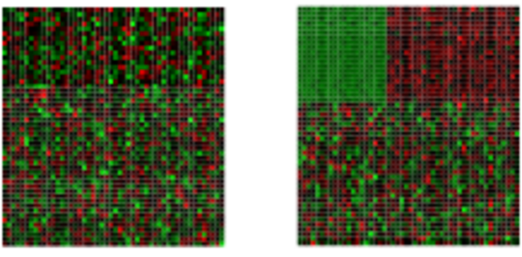

<!--
- Compile from command-line
Rscript -e "rmarkdown::render('Rclustering.Rmd', c('html_document'), clean=F); knitr::knit('Rclustering.Rmd', tangle=TRUE)"; Rscript ../md2jekyll.R Rclustering.knit.md 16; Rscript -e "rmarkdown::render('Rclustering.Rmd', c('pdf_document'))"
-->

<script type="text/javascript">
document.addEventListener("DOMContentLoaded", function() {
  document.querySelector("h1").className = "title";
});
</script>
<script type="text/javascript">
document.addEventListener("DOMContentLoaded", function() {
  var links = document.links;  
  for (var i = 0, linksLength = links.length; i < linksLength; i++)
    if (links[i].hostname != window.location.hostname)
      links[i].target = '_blank';
});
</script>


# Introduction

- What is Clustering?
    - Clustering is the classification of data objects into similarity groups (clusters) according to a defined distance measure. 
    - It is used in many fields, such as machine learning, data mining, pattern recognition, image analysis, genomics, systems biology, etc. 
    - Machine learning typically regards data clustering as a form of unsupervised learning.

- Why Clustering and Data Mining in R?}
    - Efficient data structures and functions for clustering
    - Reproducible and programmable
    - Comprehensive set of clustering and machine learning libraries 
    - Integration with many other data analysis tools

- Useful Links
    - [Cluster Task Views](http://cran.cnr.berkeley.edu/web/views/Cluster.html)
    - [Machine Learning Task Views](http://cran.cnr.berkeley.edu/web/views/MachineLearning.html)
    - [UCR Manual](http://manuals.bioinformatics.ucr.edu/home/R_BioCondManual#TOC-Clustering-and-Data-Mining-in-R)

# Data Preprocessing

## Data Transformations

Choice depends on data set!
	
- Center and standardize
    1. Center: subtract from each value the mean of the corresponding vector
	2.  Standardize: devide by standard deviation
	- Result: _Mean = 0_ and _STDEV = 1_

- Center and scale with the `scale()` function
    1. Center: subtract from each value the mean of the corresponding vector
	2. Scale: divide centered vector by their _root mean square_ (_rms_):
    $$ x_{rms} = \sqrt[]{\frac{1}{n-1}\sum_{i=1}^{n}{x_{i}{^2}}} $$
    - Result: _Mean = 0_ and _STDEV = 1_

- Log transformation 
- Rank transformation: replace measured values by ranks 
- No transformation

## Distance Methods

List of most common ones!

- Euclidean distance for two profiles _X_ and _Y_:
  $$ d(X,Y) = \sqrt[]{ \sum_{i=1}^{n}{(x_{i}-y_{i})^2} }$$
    - __Disadvantages__: not scale invariant, not for negative correlations
- Maximum, Manhattan, Canberra, binary, Minowski, ...
- Correlation-based distance: _1-r_
    - Pearson correlation coefficient (PCC):
	  $$r = \frac{n\sum_{i=1}^{n}{x_{i}y_{i}} - \sum_{i=1}^{n}{x_{i}} \sum_{i=1}^{n}{y_{i}}}{ \sqrt[]{(\sum_{i=1}^{n}{x_{i}^2} - (\sum_{i=1}^{n}{x_{i})^2}) (\sum_{i=1}^{n}{y_{i}^2} - (\sum_{i=1}^{n}{y_{i})^2})} }$$
        - __Disadvantage__: outlier sensitive 
	- Spearman correlation coefficient (SCC)
	    - Same calculation as PCC but with ranked values!

There are many more distance measures

- If the distances among items are quantifiable, then clustering is possible.
- Choose the most accurate and meaningful distance measure for a given field of application.
- If uncertain then choose several distance measures and compare the results. 

## Cluster Linkage

<center></center>

# Clustering Algorithms

## Hierarchical Clustering

### Overview of algorithm 

1. Identify clusters (items) with closest distance  
2. Join them to new clusters
3. Compute distance between clusters (items)
4. Return to step 1

#### Hierarchical clustering: agglomerative Approach
<center></center>

#### Hierarchical Clustering with Heatmap
<center></center>

- A heatmap is a color coded table. To visually identify patterns, the rows and columns of a heatmap are often sorted by hierarchical clustering trees.  
- In case of gene expression data, the row tree usually represents the genes, the column tree the treatments and the colors in the heat table represent the intensities or ratios of the underlying gene expression data set.

### Hierarchical Clustering Approaches

1. Agglomerative approach (bottom-up)
    - R functions: `hclust()` and `agnes()`

2. Divisive approach (top-down)
    - R function: `diana()`

### Tree Cutting to Obtain Discrete Clusters

1. Node height in tree
2. Number of clusters
3. Search tree nodes by distance cutoff


### Examples

#### Using `hclust` and `heatmap.2`


```r
library(gplots) 
y <- matrix(rnorm(500), 100, 5, dimnames=list(paste("g", 1:100, sep=""), paste("t", 1:5, sep=""))) 
heatmap.2(y) # Shortcut to final result
```

<!-- --> 

#### Stepwise Approach with Tree Cutting


```r
## Row- and column-wise clustering 
hr <- hclust(as.dist(1-cor(t(y), method="pearson")), method="complete")
hc <- hclust(as.dist(1-cor(y, method="spearman")), method="complete") 
## Tree cutting
mycl <- cutree(hr, h=max(hr$height)/1.5); mycolhc <- rainbow(length(unique(mycl)), start=0.1, end=0.9); mycolhc <- mycolhc[as.vector(mycl)] 
## Plot heatmap 
mycol <- colorpanel(40, "darkblue", "yellow", "white") # or try redgreen(75)
heatmap.2(y, Rowv=as.dendrogram(hr), Colv=as.dendrogram(hc), col=mycol, scale="row", density.info="none", trace="none", RowSideColors=mycolhc) 
```

<!-- --> 

## K-Means Clustering

### Overview of algorithm 

1. Choose the number of k clusters   
2. Randomly assign items to the k clusters
3. Calculate new centroid for each of the k clusters
4. Calculate the distance of all items to the k centroids
5. Assign items to closest centroid
6. Repeat until clusters assignments are stable

<center></center>
	
### Examples


```r
km <- kmeans(t(scale(t(y))), 3)
km$cluster 
```

```
##   g1   g2   g3   g4   g5   g6   g7   g8   g9  g10  g11  g12  g13  g14  g15  g16  g17  g18  g19  g20 
##    1    3    3    1    1    2    3    2    3    1    2    3    3    1    2    2    1    3    2    2 
##  g21  g22  g23  g24  g25  g26  g27  g28  g29  g30  g31  g32  g33  g34  g35  g36  g37  g38  g39  g40 
##    1    3    1    2    3    2    1    1    2    2    2    1    3    3    3    2    1    2    1    1 
##  g41  g42  g43  g44  g45  g46  g47  g48  g49  g50  g51  g52  g53  g54  g55  g56  g57  g58  g59  g60 
##    1    1    3    3    3    2    3    3    2    3    3    1    3    1    2    2    3    2    2    3 
##  g61  g62  g63  g64  g65  g66  g67  g68  g69  g70  g71  g72  g73  g74  g75  g76  g77  g78  g79  g80 
##    1    3    2    2    2    3    3    3    1    1    3    1    1    3    2    3    3    3    3    3 
##  g81  g82  g83  g84  g85  g86  g87  g88  g89  g90  g91  g92  g93  g94  g95  g96  g97  g98  g99 g100 
##    2    3    3    1    1    1    1    2    1    2    2    1    3    1    1    1    2    1    1    2
```

## Fuzzy C-Means Clustering

- In contrast to strict (hard) clustering approaches, fuzzy (soft) clustering methods allow multiple cluster memberships of the clustered items [@Hathaway1996-hu]. 
- This is commonly achieved by assigning to each item a weight of belonging to each cluster. 
- Thus, items at the edge of a cluster, may be in a cluster to a lesser degree than items at the center of a cluster. 
- Typically, each item has as many coefficients (weights) as there are clusters that sum up for each item to one.

### Examples

#### Fuzzy Clustering with `fanny`


```r
library(cluster) # Loads the cluster library.
fannyy <- fanny(y, k=4, metric = "euclidean", memb.exp = 1.2)
round(fannyy$membership, 2)[1:4,]
```

```
##    [,1] [,2] [,3] [,4]
## g1 0.78 0.03 0.08 0.11
## g2 0.03 0.91 0.03 0.03
## g3 0.07 0.89 0.02 0.02
## g4 0.03 0.02 0.88 0.07
```

```r
fannyy$clustering 
```

```
##   g1   g2   g3   g4   g5   g6   g7   g8   g9  g10  g11  g12  g13  g14  g15  g16  g17  g18  g19  g20 
##    1    2    2    3    1    4    1    4    1    3    4    2    2    1    3    4    1    2    4    4 
##  g21  g22  g23  g24  g25  g26  g27  g28  g29  g30  g31  g32  g33  g34  g35  g36  g37  g38  g39  g40 
##    3    1    3    4    2    4    3    1    4    3    4    1    2    2    2    3    1    4    3    3 
##  g41  g42  g43  g44  g45  g46  g47  g48  g49  g50  g51  g52  g53  g54  g55  g56  g57  g58  g59  g60 
##    2    3    2    1    1    2    4    2    4    1    2    1    2    3    4    4    4    4    4    4 
##  g61  g62  g63  g64  g65  g66  g67  g68  g69  g70  g71  g72  g73  g74  g75  g76  g77  g78  g79  g80 
##    1    2    4    4    4    2    4    2    1    3    2    3    1    4    4    1    4    1    2    1 
##  g81  g82  g83  g84  g85  g86  g87  g88  g89  g90  g91  g92  g93  g94  g95  g96  g97  g98  g99 g100 
##    4    2    2    3    1    1    3    4    1    4    1    3    2    3    1    3    3    3    3    4
```
	
## Principal Component Analysis (PCA)

Principal components analysis (PCA) is a data reduction technique that allows to simplify multidimensional data sets to 2 or 3 dimensions for plotting purposes and visual variance analysis.

### Basic Steps

- Center (and standardize) data
- First principal component axis
    - Across centroid of data cloud
	- Distance of each point to that line is minimized, so that it crosses the maximum variation of the data cloud
- Second principal component axis 
    - Orthogonal to first principal component
	- Along maximum variation in the data
- First PCA axis becomes x-axis and second PCA axis y-axis 
- Continue process until the necessary number of principal components is obtained 

<center></center>

### Example


```r
pca <- prcomp(y, scale=T)
summary(pca) # Prints variance summary for all principal components
```

```
## Importance of components%s:
##                           PC1    PC2    PC3    PC4    PC5
## Standard deviation     1.1055 1.0346 1.0148 0.9312 0.9003
## Proportion of Variance 0.2444 0.2141 0.2059 0.1734 0.1621
## Cumulative Proportion  0.2444 0.4585 0.6644 0.8379 1.0000
```

```r
plot(pca$x, pch=20, col="blue", type="n") # To plot dots, drop type="n"
text(pca$x, rownames(pca$x), cex=0.8)
```

<!-- --> 
1st and 2nd principal components explain x% of variance in data.

## Multidimensional Scaling (MDS)

- Alternative dimensionality reduction approach
- Represents distances in 2D or 3D space
- Starts from distance matrix (PCA uses data points)

### Example

The following example performs MDS analysis with `cmdscale` on the geographic distances among European cities.


```r
loc <- cmdscale(eurodist) 
plot(loc[,1], -loc[,2], type="n", xlab="", ylab="", main="cmdscale(eurodist)")
text(loc[,1], -loc[,2], rownames(loc), cex=0.8) 
```

<!-- --> 

## Biclustering

Finds in matrix subgroups of rows and columns which are as similar as possible to each other and as different as possible to the remaining data points.

<center></center>
<center> Unclustered --------------------------> Clustered</center>

## Similarity Measures for Clusters

- Compare the numbers of identical and unique item pairs appearing in cluster sets
- Achieved by counting the number of item pairs found in both clustering sets _(a)_ as well as the pairs appearing only in the first _(b)_ or the second _(c)_ set. 
- With this a similarity coefficient, such as the Jaccard index, can be computed. The latter is defined as the size of the intersect divided by the size of the union of two sample sets: _a/(a+b+c)_. 
- In case of partitioning results, the Jaccard Index measures how frequently pairs of items are joined together in two clustering data sets and how often pairs are observed only in one set. 
- Related coefficient are the Rand Index and the Adjusted Rand Index. These indices also consider the number of pairs _(d)_ that are not joined together in any of the clusters in both sets. 

### Example: 

#### Jaccard index for cluster sets

The following imports the `cindex()` function and computes the Jaccard Index for two sample clusters.


```r
source("http://faculty.ucr.edu/~tgirke/Documents/R_BioCond/My_R_Scripts/clusterIndex.R") 
library(cluster); y <- matrix(rnorm(5000), 1000, 5, dimnames=list(paste("g", 1:1000, sep=""), paste("t", 1:5, sep=""))); clarax <- clara(y, 49); clV1 <- clarax$clustering; clarax <- clara(y, 50); clV2 <- clarax$clustering 
ci <- cindex(clV1=clV1, clV2=clV2, self=FALSE, minSZ=1, method="jaccard")
ci[2:3] # Returns Jaccard index and variables used to compute it 
```

```
## $variables
##    a    b    c 
## 5073 8762 8423 
## 
## $Jaccard_Index
## [1] 0.2279181
```

#### Clustering cluster sets with Jaccard index

The following example shows how one can cluster entire cluster result sets. First, 10 sample cluster results are created with Clara using k-values from 3 to 12. The results are stored as named clustering vectors in a list object. Then a nested sapply loop is used to generate a similarity matrix of Jaccard Indices for the clustering results. After converting the result into a distance matrix, hierarchical clustering is performed with `hclust`.}


```r
clVlist <- lapply(3:12, function(x) clara(y[1:30, ], k=x)$clustering); names(clVlist) <- paste("k", "=", 3:12)
d <- sapply(names(clVlist), function(x) sapply(names(clVlist), function(y) cindex(clV1=clVlist[[y]], clV2=clVlist[[x]], method="jaccard")[[3]]))
hv <- hclust(as.dist(1-d))
plot(as.dendrogram(hv), edgePar=list(col=3, lwd=4), horiz=T, main="Similarities of 10 Clara Clustering Results for k: 3-12") 
```

<!-- --> 

- Remember: there are many additional clustering algorithms.
- Additional details can be found in the Clustering Section of the [R/Bioconductor Manual](http://manuals.bioinformatics.ucr.edu/home/R_BioCondManual\#TOC-Clustering-and-Data-Mining-in-R).

# Clustering Exercises

## Data Preprocessing

### Scaling 


```r
## Sample data set
set.seed(1410)
y <- matrix(rnorm(50), 10, 5, dimnames=list(paste("g", 1:10, sep=""), 
            paste("t", 1:5, sep="")))
dim(y)
```

```
## [1] 10  5
```

```r
## Scaling
yscaled <- t(scale(t(y))) # Centers and scales y row-wise
apply(yscaled, 1, sd)
```

```
##  g1  g2  g3  g4  g5  g6  g7  g8  g9 g10 
##   1   1   1   1   1   1   1   1   1   1
```

## Distance Matrices

### Euclidean distance matrix


```r
dist(y[1:4,], method = "euclidean")
```

```
##          g1       g2       g3
## g2 4.793697                  
## g3 4.932658 6.354978         
## g4 4.033789 4.788508 1.671968
```

### Correlation-based distance matrix

Correlation matrix

```r
c <- cor(t(y), method="pearson") 
as.matrix(c)[1:4,1:4]
```

```
##             g1         g2          g3         g4
## g1  1.00000000 -0.2965885 -0.00206139 -0.4042011
## g2 -0.29658847  1.0000000 -0.91661118 -0.4512912
## g3 -0.00206139 -0.9166112  1.00000000  0.7435892
## g4 -0.40420112 -0.4512912  0.74358925  1.0000000
```

Correlation-based distance matrix

```r
d <- as.dist(1-c)
as.matrix(d)[1:4,1:4]
```

```
##          g1       g2        g3        g4
## g1 0.000000 1.296588 1.0020614 1.4042011
## g2 1.296588 0.000000 1.9166112 1.4512912
## g3 1.002061 1.916611 0.0000000 0.2564108
## g4 1.404201 1.451291 0.2564108 0.0000000
```
	
## Hierarchical Clustering with `hclust`

Hierarchical clustering with complete linkage and basic tree plotting

```r
hr <- hclust(d, method = "complete", members=NULL)
names(hr)
```

```
## [1] "merge"       "height"      "order"       "labels"      "method"      "call"       
## [7] "dist.method"
```

```r
par(mfrow = c(1, 2)); plot(hr, hang = 0.1); plot(hr, hang = -1) 
```

<!-- --> 

### Tree plotting I


```r
plot(as.dendrogram(hr), edgePar=list(col=3, lwd=4), horiz=T) 
```

<!-- --> 

### Tree plotting II

The `ape` library provides more advanced features for tree plotting


```r
library(ape) 
plot.phylo(as.phylo(hr), type="p", edge.col=4, edge.width=2, 
           show.node.label=TRUE, no.margin=TRUE)
```

<!-- --> 

## Tree Cutting

Accessing information in _hclust_ objects 


```r
hr
```

```
## 
## Call:
## hclust(d = d, method = "complete", members = NULL)
## 
## Cluster method   : complete 
## Number of objects: 10
```

```r
## Print row labels in the order they appear in the tree
hr$labels[hr$order] 
```

```
##  [1] "g10" "g3"  "g4"  "g2"  "g9"  "g6"  "g7"  "g1"  "g5"  "g8"
```

Tree cutting with `cutree`

```r
mycl <- cutree(hr, h=max(hr$height)/2)
mycl[hr$labels[hr$order]] 
```

```
## g10  g3  g4  g2  g9  g6  g7  g1  g5  g8 
##   3   3   3   2   2   5   5   1   4   4
```

## Heatmaps

### With `heatmap.2`

All in one step: clustering and heatmap plotting

```r
library(gplots)
heatmap.2(y, col=redgreen(75))
```

<!-- --> 

### With `pheatmap`

All in one step: clustering and heatmap plotting

```r
library(pheatmap); library("RColorBrewer")
pheatmap(y, color=brewer.pal(9,"Blues"))
```

<!-- --> 

### Customizing heatmaps

Customizes row and column clustering and shows tree cutting result in row color bar. Additional color schemes can be found [here](http://manuals.bioinformatics.ucr.edu/home/R\_BioCondManual\#clustering\_hc\_submap).


```r
hc <- hclust(as.dist(1-cor(y, method="spearman")), method="complete")
mycol <- colorpanel(40, "darkblue", "yellow", "white")
heatmap.2(y, Rowv=as.dendrogram(hr), Colv=as.dendrogram(hc), col=mycol,
          scale="row", density.info="none", trace="none", 
          RowSideColors=as.character(mycl))
```

<!-- --> 
	
## K-Means Clustering with PAM

Runs K-means clustering with PAM (partitioning around medoids) algorithm and shows result in color bar of hierarchical clustering result from before.


```r
library(cluster)
pamy <- pam(d, 4)
(kmcol <- pamy$clustering)
```

```
##  g1  g2  g3  g4  g5  g6  g7  g8  g9 g10 
##   1   2   3   3   4   4   4   4   2   3
```

```r
heatmap.2(y, Rowv=as.dendrogram(hr), Colv=as.dendrogram(hc), col=mycol,
          scale="row", density.info="none", trace="none", 
          RowSideColors=as.character(kmcol))
```

<!-- --> 

## K-Means Fuzzy Clustering

Performs k-means fuzzy clustering

```r
library(cluster)
fannyy <- fanny(d, k=4, memb.exp = 1.5)
round(fannyy$membership, 2)[1:4,]
```

```
##    [,1] [,2] [,3] [,4]
## g1 1.00 0.00 0.00 0.00
## g2 0.00 0.99 0.00 0.00
## g3 0.02 0.01 0.95 0.03
## g4 0.00 0.00 0.99 0.01
```

```r
fannyy$clustering 
```

```
##  g1  g2  g3  g4  g5  g6  g7  g8  g9 g10 
##   1   2   3   3   4   4   4   4   2   3
```

```r
## Returns multiple cluster memberships for coefficient above a certain 
## value (here >0.1)
fannyyMA <- round(fannyy$membership, 2) > 0.10 
apply(fannyyMA, 1, function(x) paste(which(x), collapse="_"))
```

```
##    g1    g2    g3    g4    g5    g6    g7    g8    g9   g10 
##   "1"   "2"   "3"   "3"   "4"   "4"   "4" "2_4"   "2"   "3"
```

## Multidimensional Scaling (MDS) 

Performs MDS analysis on the geographic distances between European cities


```r
loc <- cmdscale(eurodist) 
## Plots the MDS results in 2D plot. The minus is required in this example to 
## flip the plotting orientation.
plot(loc[,1], -loc[,2], type="n", xlab="", ylab="", main="cmdscale(eurodist)")
text(loc[,1], -loc[,2], rownames(loc), cex=0.8) 
```

<!-- --> 

## Principal Component Analysis (PCA)

Performs PCA analysis after scaling the data. It returns a list with class `prcomp` that contains five components: (1) the standard deviations (sdev) of the principal components, (2) the matrix of eigenvectors (rotation), (3) the principal component data (x), (4) the centering (center) and (5) scaling (scale) used.

```r
library(scatterplot3d)
pca <- prcomp(y, scale=TRUE)
names(pca)
```

```
## [1] "sdev"     "rotation" "center"   "scale"    "x"
```

```r
summary(pca) # Prints variance summary for all principal components.
```

```
## Importance of components%s:
##                           PC1    PC2    PC3     PC4    PC5
## Standard deviation     1.3611 1.1777 1.0420 0.69264 0.4416
## Proportion of Variance 0.3705 0.2774 0.2172 0.09595 0.0390
## Cumulative Proportion  0.3705 0.6479 0.8650 0.96100 1.0000
```

```r
scatterplot3d(pca$x[,1:3], pch=20, color="blue") 
```

<!-- --> 

## Additional Exercises

See [here](http://manuals.bioinformatics.ucr.edu/home/R_BioCondManual#TOC-Clustering-Exercises)

# Version Information


```r
sessionInfo()
```

```
## R version 3.4.0 (2017-04-21)
## Platform: x86_64-pc-linux-gnu (64-bit)
## Running under: Ubuntu 14.04.5 LTS
## 
## Matrix products: default
## BLAS: /usr/lib/libblas/libblas.so.3.0
## LAPACK: /usr/lib/lapack/liblapack.so.3.0
## 
## locale:
##  [1] LC_CTYPE=en_US.UTF-8       LC_NUMERIC=C               LC_TIME=en_US.UTF-8       
##  [4] LC_COLLATE=en_US.UTF-8     LC_MONETARY=en_US.UTF-8    LC_MESSAGES=en_US.UTF-8   
##  [7] LC_PAPER=en_US.UTF-8       LC_NAME=C                  LC_ADDRESS=C              
## [10] LC_TELEPHONE=C             LC_MEASUREMENT=en_US.UTF-8 LC_IDENTIFICATION=C       
## 
## attached base packages:
## [1] stats     graphics  utils     datasets  grDevices base     
## 
## other attached packages:
## [1] scatterplot3d_0.3-40 RColorBrewer_1.1-2   pheatmap_1.0.8       cluster_2.0.6       
## [5] gplots_3.0.1         ape_4.1              ggplot2_2.2.1        BiocStyle_2.4.0     
## 
## loaded via a namespace (and not attached):
##  [1] Rcpp_0.12.10       knitr_1.15.1       magrittr_1.5       munsell_0.4.3      colorspace_1.3-2  
##  [6] lattice_0.20-35    stringr_1.2.0      plyr_1.8.4         caTools_1.17.1     tools_3.4.0       
## [11] parallel_3.4.0     grid_3.4.0         gtable_0.2.0       nlme_3.1-131       KernSmooth_2.23-15
## [16] gtools_3.5.0       htmltools_0.3.5    yaml_2.1.14        lazyeval_0.2.0     rprojroot_1.2     
## [21] digest_0.6.12      tibble_1.3.0       bitops_1.0-6       codetools_0.2-15   evaluate_0.10     
## [26] rmarkdown_1.5      gdata_2.17.0       stringi_1.1.5      compiler_3.4.0     methods_3.4.0     
## [31] scales_0.4.1       backports_1.0.5
```

# References
