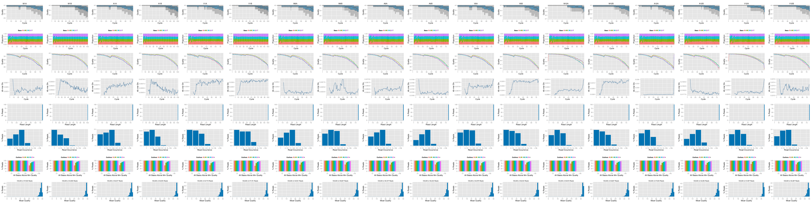
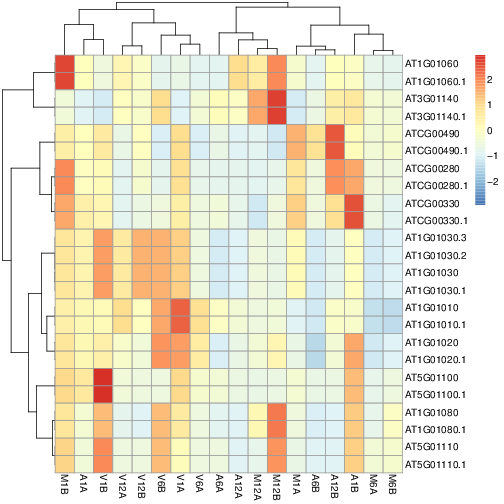

```{css, echo=FALSE}
pre code {
white-space: pre !important;
overflow-x: scroll !important;
word-break: keep-all !important;
word-wrap: initial !important;
}
```

<!--
- Compile from command-line
Rscript -e "rmarkdown::render('systemPipeR.Rmd', c('BiocStyle::html_document'), clean=F); knitr::knit('systemPipeR.Rmd', tangle=TRUE)"; Rscript ../md2jekyll.R systemPipeR.knit.md 2; Rscript -e "rmarkdown::render('systemPipeR.Rmd', c('BiocStyle::pdf_document'))"
-->

```{r style, echo = FALSE, results = 'asis'}
BiocStyle::markdown()
options(width=80, max.print=1000)
knitr::opts_chunk$set(
    eval=as.logical(Sys.getenv("KNITR_EVAL", "TRUE")),
    cache=as.logical(Sys.getenv("KNITR_CACHE", "TRUE")), 
    tidy.opts=list(width.cutoff=80), tidy=TRUE)
```

```{r setup, echo=FALSE, message=FALSE, warning=FALSE}
suppressPackageStartupMessages({
    library(systemPipeR)
    library(BiocParallel)
    library(Biostrings)
    library(Rsamtools)
    library(GenomicRanges)
    library(ggplot2)
    library(GenomicAlignments)
    library(ShortRead)
    library(ape)
    library(batchtools)
    library(magrittr)
})
```

# Workflow steps overview

## Define environment settings and samples

A typical workflow starts with generating the expected working environment
containing the proper directory structure, input files, and parameter settings.
To simplify this task, one can load one of the existing NGS workflows templates
provided by _`systemPipeRdata`_ into the current working directory. The
following does this for the _`rnaseq`_ template. The name of the resulting
workflow directory can be specified under the _`mydirname`_ argument. The
default _`NULL`_ uses the name of the chosen workflow. An error is issued if a
directory of the same name and path exists already. On Linux and OS X systems
one can also create new workflow instances from the command-line of a terminal as shown
[here](http://bioconductor.org/packages/devel/data/experiment/vignettes/systemPipeRdata/inst/doc/systemPipeRdata.html#generate-workflow-template).
To apply workflows to custom data, the user needs to modify the _`targets`_ file and if
necessary update the corresponding _`.cwl`_ and _`.yml`_ files. A collection of pre-generated _`.cwl`_ and _`.yml`_ files are provided in the _`param/cwl`_ subdirectory of each workflow template. They
are also viewable in the GitHub repository of _`systemPipeRdata`_ ([see
here](https://github.com/tgirke/systemPipeRdata/tree/master/inst/extdata/param)).

```{r load_package, eval=FALSE}
library(systemPipeR)
library(systemPipeRdata)
genWorkenvir(workflow="rnaseq", mydirname=NULL)
setwd("rnaseq")
```

## Read Preprocessing

### Preprocessing with _`preprocessReads`_ function

The function _`preprocessReads`_ allows to apply predefined or custom
read preprocessing functions to all FASTQ files referenced in a
_`SYSargs2`_ container, such as quality filtering or adaptor trimming
routines. The paths to the resulting output FASTQ files are stored in the
_`output`_ slot of the _`SYSargs2`_ object. Internally,
_`preprocessReads`_ uses the _`FastqStreamer`_ function from
the _`ShortRead`_ package to stream through large FASTQ files in a
memory-efficient manner. The following example performs adaptor trimming with
the _`trimLRPatterns`_ function from the _`Biostrings`_ package.
After the trimming step a new targets file is generated (here
_`targets_trimPE.txt`_) containing the paths to the trimmed FASTQ files.
The new targets file can be used for the next workflow step with an updated
_`SYSargs2`_ instance, _e.g._ running the NGS alignments with the
trimmed FASTQ files.

Construct _`SYSargs2`_ object from _`cwl`_ and _`yml`_ param and _`targets`_ files.

```{r construct_SYSargs2_trim-se, echo = FALSE, eval=FALSE}
targets <- system.file("extdata", "targets.txt", package="systemPipeR")
dir_path <- system.file("extdata/cwl/preprocessReads/trim-se", package="systemPipeR")
trim <- loadWorkflow(targets=targets, wf_file="trim-se.cwl", input_file="trim-se.yml", dir_path=dir_path)
trim <- renderWF(trim, inputvars=c(FileName="_FASTQ_PATH1_", SampleName="_SampleName_"))
trim
```

```{r construct_SYSargs2_trim-pe, eval=FALSE}
targetsPE <- system.file("extdata", "targetsPE.txt", package="systemPipeR")
dir_path <- system.file("extdata/cwl/preprocessReads/trim-pe", package="systemPipeR")
trim <- loadWorkflow(targets=targetsPE, wf_file="trim-pe.cwl", input_file="trim-pe.yml", dir_path=dir_path)
trim <- renderWF(trim, inputvars=c(FileName1="_FASTQ_PATH1_", FileName2="_FASTQ_PATH2_", SampleName="_SampleName_"))
trim
output(trim)[1:2]
```

```{r preprocessing, eval=FALSE}
preprocessReads(args=trim, Fct="trimLRPatterns(Rpattern='GCCCGGGTAA', 
                subject=fq)", batchsize=100000, overwrite=TRUE, compress=TRUE)
```

The following example shows how one can design a custom read preprocessing function 
using utilities provided by the _`ShortRead`_ package, and then run it
in batch mode with the _'preprocessReads'_ function (here on paired-end reads).

```{r custom_preprocessing, eval=FALSE}
filterFct <- function(fq, cutoff=20, Nexceptions=0) {
    qcount <- rowSums(as(quality(fq), "matrix") <= cutoff, na.rm=TRUE)
    # Retains reads where Phred scores are >= cutoff with N exceptions
    fq[qcount <= Nexceptions] 
}
preprocessReads(args=trim, Fct="filterFct(fq, cutoff=20, Nexceptions=0)", 
                batchsize=100000)
```

### Preprocessing with TrimGalore!

[TrimGalore!](http://www.bioinformatics.babraham.ac.uk/projects/trim_galore/) is 
a wrapper tool to consistently apply quality and adapter trimming to fastq files, 
with some extra functionality for removing Reduced Representation Bisulfite-Seq 
(RRBS) libraries. 

```{r trimGalore, eval=FALSE}
targets <- system.file("extdata", "targets.txt", package="systemPipeR")
dir_path <- system.file("extdata/cwl/trim_galore/trim_galore-se", package="systemPipeR")
trimG <- loadWorkflow(targets=targets, wf_file="trim_galore-se.cwl", input_file="trim_galore-se.yml", dir_path=dir_path)
trimG <- renderWF(trimG, inputvars=c(FileName="_FASTQ_PATH1_", SampleName="_SampleName_"))
trimG
cmdlist(trimG)[1:2]
output(trimG)[1:2]
## Run Single Machine Option
trimG <- runCommandline(trimG[1], make_bam = FALSE)
```

### Preprocessing with Trimmomatic

```{r trimmomatic, eval=FALSE}
targetsPE <- system.file("extdata", "targetsPE.txt", package="systemPipeR")
dir_path <- system.file("extdata/cwl/trimmomatic/trimmomatic-pe", package="systemPipeR")
trimM <- loadWorkflow(targets=targetsPE, wf_file="trimmomatic-pe.cwl", input_file="trimmomatic-pe.yml", dir_path=dir_path)
trimM <- renderWF(trimM, inputvars=c(FileName1="_FASTQ_PATH1_", FileName2="_FASTQ_PATH2_", SampleName="_SampleName_"))
trimM
cmdlist(trimM)[1:2]
output(trimM)[1:2]
## Run Single Machine Option
trimM <- runCommandline(trimM[1], make_bam = FALSE)
```

## FASTQ quality report

The following _`seeFastq`_ and _`seeFastqPlot`_ functions generate and plot a series of
useful quality statistics for a set of FASTQ files including per cycle quality
box plots, base proportions, base-level quality trends, relative k-mer
diversity, length and occurrence distribution of reads, number of reads above
quality cutoffs and mean quality distribution.  
The function _`seeFastq`_ computes the quality statistics and stores the results in a
relatively small list object that can be saved to disk with _`save()`_ and
reloaded with _`load()`_ for later plotting. The argument _`klength`_ specifies the
k-mer length and _`batchsize`_ the number of reads to a random sample from each
FASTQ file.

```{r fastq_quality, eval=FALSE}
fqlist <- seeFastq(fastq=infile1(trim), batchsize=10000, klength=8)
pdf("./results/fastqReport.pdf", height=18, width=4*length(fqlist))
seeFastqPlot(fqlist)
dev.off()
```

<center></center>
<div align="center">**Figure 5:** FASTQ quality report </div></br>

Parallelization of FASTQ quality report on a single machine with multiple cores.

```{r fastq_quality_parallel_single, eval=FALSE}
f <- function(x) seeFastq(fastq=infile1(trim)[x], batchsize=100000, klength=8)
fqlist <- bplapply(seq(along=trim), f, BPPARAM = MulticoreParam(workers=4))
seeFastqPlot(unlist(fqlist, recursive=FALSE))
```

Parallelization of FASTQ quality report via scheduler (_e.g._ Slurm) across several compute nodes.

```{r fastq_quality_parallel_cluster, eval=FALSE}
library(BiocParallel); library(batchtools)
f <- function(x) {
  library(systemPipeR)
  targetsPE <- system.file("extdata", "targetsPE.txt", package="systemPipeR")
  dir_path <- system.file("extdata/cwl/preprocessReads/trim-pe", package="systemPipeR")
  trim <- loadWorkflow(targets=targetsPE, wf_file="trim-pe.cwl", input_file="trim-pe.yml", dir_path=dir_path)
  trim <- renderWF(trim, inputvars=c(FileName1="_FASTQ_PATH1_", FileName2="_FASTQ_PATH2_", SampleName="_SampleName_"))
  seeFastq(fastq=infile1(trim)[x], batchsize=100000, klength=8)
}
resources <- list(walltime=120, ntasks=1, ncpus=4, memory=1024) 
param <- BatchtoolsParam(workers = 4, cluster = "slurm", template = "batchtools.slurm.tmpl", resources = resources)
fqlist <- bplapply(seq(along=trim), f, BPPARAM = param)
seeFastqPlot(unlist(fqlist, recursive=FALSE))
```

## NGS Alignment software

After quality control, the sequence reads can be aligned to a reference genome or 
transcriptome database. The following sessions present some NGS sequence alignment 
software. Select the most accurate aligner and determining the optimal parameter 
for your custom data set project.

For all the following examples, it is necessary to install the respective software 
and export the `PATH` accordingly. If it is available [Environment Module](http://modules.sourceforge.net/) 
in the system, you can load all the request software with _`moduleload(args)`_ function.

### Alignment with `HISAT2` using _`SYSargs2`_

The following steps will demonstrate how to use the short read aligner `Hisat2`
[@Kim2015-ve] in both interactive job submissions and batch submissions to
queuing systems of clusters using the _`systemPipeR's`_ new CWL command-line interface.

The parameter settings of the aligner are defined in the `hisat2-mapping-se.cwl` 
and `hisat2-mapping-se.yml` files. The following shows how to construct the 
corresponding *SYSargs2* object, here *args*.

```{r hisat_SYSargs2_object, eval=TRUE}
targets <- system.file("extdata", "targets.txt", package="systemPipeR")
dir_path <- system.file("extdata/cwl/hisat2/hisat2-se", package="systemPipeR")
args <- loadWorkflow(targets=targets, wf_file="hisat2-mapping-se.cwl", input_file="hisat2-mapping-se.yml", dir_path=dir_path)
args <- renderWF(args, inputvars=c(FileName="_FASTQ_PATH1_", SampleName="_SampleName_"))
args
cmdlist(args)[1:2]
output(args)[1:2]
```

Subsetting _`SYSargs2`_ class slots for each workflow step.

```{r subset, eval=TRUE}
subsetWF(args, slot="input", subset='FileName')[1:2] ## Subsetting the input files for this particular workflow 
subsetWF(args, slot="output", subset=1, index=1)[1:2]  ## Subsetting the output files for one particular step in the workflow 
subsetWF(args, slot="step", subset=1)[1] ## Subsetting the command-lines for one particular step in the workflow 
subsetWF(args, slot="output", subset=1, index=1, delete=TRUE)[1] ## DELETING specific output files
```

Build `Hisat2` index.

```{r hisat_index, eval=FALSE}
dir_path <- system.file("extdata/cwl/hisat2/hisat2-idx", package="systemPipeR")
idx <- loadWorkflow(targets=NULL, wf_file="hisat2-index.cwl", input_file="hisat2-index.yml", dir_path=dir_path)
idx <- renderWF(idx)
idx
cmdlist(idx)

## Run 
runCommandline(idx, make_bam = FALSE)
```

#### Interactive job submissions in a single machine

To simplify the short read alignment execution for the user, the command-line 
can be run with the *`runCommandline`* function.
The execution will be on a single machine without submitting to a queuing system 
of a computer cluster. This way, the input FASTQ files will be processed sequentially. 
By default *`runCommandline`* auto detects SAM file outputs and converts them 
to sorted and indexed BAM files, using internally the `Rsamtools` package 
[@Rsamtools]. Besides, *`runCommandline`* allows the user to create a dedicated
results folder for each workflow and a sub-folder for each sample 
defined in the *targets* file. This includes all the output and log files for each 
step. When these options are used, the output location will be updated by default 
and can be assigned to the same object.

```{r runCommandline_align, eval=FALSE}
args <- runCommandline(args, make_bam = TRUE) ## same as above but writes files and converts *.sam files to sorted and indexed BAM files. Assigning the new extension of the output files to the object args.
```

If available, multiple CPU cores can be used for processing each file. The number
of CPU cores (here 4) to use for each process is defined in the _`*.yml`_ file. 
With _`yamlinput(args)['thread']`_ one can return this value from the _`SYSargs2`_ object. 

Please note that for each step in the Workflow, the results files can be store
in a specific folder, as the following: 

```{r runCommandline_align_dir, eval=FALSE}
args <- runCommandline(args, dir = TRUE, dir.name = "hisat2")
```

If available, multiple CPU cores can be used for processing each file. The number
of CPU cores (here 4) to use for each process is defined in the _`*.yml`_ file. 
With _`yamlinput(args)['thread']`_ one can return this value from the _`SYSargs2`_ object. 


#### Parallelization on clusters

Alternatively, the computation can be greatly accelerated by processing many files 
in parallel using several compute nodes of a cluster, where a scheduling/queuing
system is used for load balancing. For this the *`clusterRun`* function submits 
the computing requests to the scheduler using the run specifications
defined by *`runCommandline`*. 

To avoid over-subscription of CPU cores on the compute nodes, the value from 
_`yamlinput(args)['thread']`_ is passed on to the submission command, here _`ncpus`_ 
in the _`resources`_ list object. The number of independent parallel cluster 
processes is defined under the _`Njobs`_ argument. The following example will run 
18 processes in parallel using for each 4 CPU cores. If the resources available
on a cluster allow running all 18 processes at the same time then the shown sample 
submission will utilize in total 72 CPU cores. Note, *`clusterRun`* can be used
with most queueing systems as it is based on utilities from the _`batchtools`_ 
package which supports the use of template files (_`*.tmpl`_) for defining the 
run parameters of different schedulers. To run the following code, one needs to 
have both a conf file (see _`.batchtools.conf.R`_ samples [here](https://mllg.github.io/batchtools/)) 
and a template file (see _`*.tmpl`_ samples [here](https://github.com/mllg/batchtools/tree/master/inst/templates)) 
for the queueing available on a system. The following example uses the sample 
conf and template files for the Slurm scheduler provided by this package.  

```{r clusterRun_args, eval=FALSE}
library(batchtools)
resources <- list(walltime=120, ntasks=1, ncpus=4, memory=1024)
reg <- clusterRun(args, FUN = runCommandline, more.args = list(args=args, make_bam=TRUE, dir=FALSE), 
                  conffile = ".batchtools.conf.R", template = "batchtools.slurm.tmpl", 
                  Njobs=18, runid="01", resourceList=resources)
getStatus(reg=reg)
waitForJobs(reg=reg)
```

Check and update the output location if necessary.

```{r output, eval=FALSE}
args <- output_update(args, dir=FALSE, replace=TRUE, extension=c(".sam", ".bam")) ## Updates the output(args) to the right location in the subfolders
output(args)
```

#### Create new targets file

To establish the connectivity to the next workflow step, one can write a new
*targets* file with the *`writeTargetsout`* function. The new *targets* file
serves as input to the next *`loadWorkflow`* and *`renderWF`* call.

```{r writeTargetsout, eval=FALSE}
names(clt(args))
writeTargetsout(x=args, file="default", step = 1, 
                new_col = "FileName", new_col_output_index = 1, overwrite = TRUE)
```

#### Alignment with `HISAT2` and `SAMtools`

Alternatively, it possible to build an workflow with `HISAT2` and `SAMtools`.

```{r hisat_alignment, eval=FALSE}
targets <- system.file("extdata", "targets.txt", package="systemPipeR")
dir_path <- system.file("extdata/cwl/workflow-hisat2/workflow-hisat2-se", package="systemPipeR")
WF <- loadWorkflow(targets=targets, wf_file="workflow_hisat2-se.cwl", input_file="workflow_hisat2-se.yml", dir_path=dir_path)
WF <- renderWF(WF, inputvars=c(FileName="_FASTQ_PATH1_", SampleName="_SampleName_"))
WF
cmdlist(WF)[1:2]
output(WF)[1:2]
```

### Alignment with _`Tophat2`_ 

The NGS reads of this project can also be aligned against the reference genome 
sequence using `Bowtie2/TopHat2` [@Kim2013-vg; @Langmead2012-bs]. 

Build _`Bowtie2`_ index.

```{r bowtie_index, eval=FALSE}
dir_path <- system.file("extdata/cwl/bowtie2/bowtie2-idx", package="systemPipeR")
idx <- loadWorkflow(targets=NULL, wf_file="bowtie2-index.cwl", input_file="bowtie2-index.yml", dir_path=dir_path)
idx <- renderWF(idx)
idx
cmdlist(idx)

## Run in single machine
runCommandline(idx, make_bam = FALSE)
```

The parameter settings of the aligner are defined in the `tophat2-mapping-pe.cwl` 
and `tophat2-mapping-pe.yml` files. The following shows how to construct the 
corresponding *SYSargs2* object, here *tophat2PE*.

```{r tophat2-pe, eval=FALSE}
targetsPE <- system.file("extdata", "targetsPE.txt", package = "systemPipeR")
dir_path <- system.file("extdata/cwl/tophat2/tophat2-pe", package="systemPipeR")
tophat2PE <- loadWorkflow(targets = targetsPE, wf_file = "tophat2-mapping-pe.cwl", 
    input_file = "tophat2-mapping-pe.yml", dir_path = dir_path)
tophat2PE <- renderWF(tophat2PE, inputvars = c(FileName1 = "_FASTQ_PATH1_", FileName2 = "_FASTQ_PATH2_", 
    SampleName = "_SampleName_"))
tophat2PE
cmdlist(tophat2PE)[1:2]
output(tophat2PE)[1:2]

## Run in single machine
tophat2PE <- runCommandline(tophat2PE[1], make_bam = TRUE)
```

Parallelization on clusters.

```{r tophat2-pe_parallel, eval=FALSE}
resources <- list(walltime=120, ntasks=1, ncpus=4, memory=1024) 
reg <- clusterRun(tophat2PE, FUN = runCommandline, more.args = list(args=tophat2PE, make_bam=TRUE, dir=FALSE), 
                  conffile = ".batchtools.conf.R", template = "batchtools.slurm.tmpl", 
                  Njobs=18, runid="01", resourceList=resources)
waitForJobs(reg=reg)
```

Create new targets file

```{r writeTargetsout_tophat2PE, eval=FALSE}
names(clt(tophat2PE))
writeTargetsout(x=tophat2PE, file="default", step = 1, 
                new_col = "tophat2PE", new_col_output_index = 1, overwrite = TRUE)
```

### Alignment with _`Bowtie2`_ (_e.g._ for miRNA profiling)

The following example runs _`Bowtie2`_ as a single process without submitting it to a cluster.

Building the index:
```{r bowtie2_index, eval=FALSE}
dir_path <- system.file("extdata/cwl/bowtie2/bowtie2-idx", package="systemPipeR")
idx <- loadWorkflow(targets=NULL, wf_file="bowtie2-index.cwl", input_file="bowtie2-index.yml", dir_path=dir_path)
idx <- renderWF(idx)
idx
cmdlist(idx)

## Run in single machine
runCommandline(idx, make_bam = FALSE)
```

Building all the command-line:

```{r bowtie2_SYSargs2, eval=FALSE}
targetsPE <- system.file("extdata", "targetsPE.txt", package = "systemPipeR")
dir_path <- system.file("extdata/cwl/bowtie2/bowtie2-pe", package="systemPipeR")
bowtiePE <- loadWorkflow(targets = targetsPE, wf_file = "bowtie2-mapping-pe.cwl", 
    input_file = "bowtie2-mapping-pe.yml", dir_path = dir_path)
bowtiePE <- renderWF(bowtiePE, inputvars = c(FileName1 = "_FASTQ_PATH1_", FileName2 = "_FASTQ_PATH2_", 
    SampleName = "_SampleName_"))
bowtiePE
cmdlist(bowtiePE)[1:2]
output(bowtiePE)[1:2]
```

Running all the jobs to computing nodes.

```{r bowtie2_cluster, eval=FALSE}
resources <- list(walltime=120, ntasks=1, ncpus=4, memory=1024) 
reg <- clusterRun(bowtiePE, FUN = runCommandline, more.args = list(args=bowtiePE, dir = FALSE), 
    conffile = ".batchtools.conf.R", template = "batchtools.slurm.tmpl", 
    Njobs = 18, runid = "01", resourceList = resources)
getStatus(reg = reg)
```

Alternatively, it possible to run all the jobs in a single machine.

```{r bowtie2_sm, eval=FALSE}
bowtiePE <- runCommandline(bowtiePE)
```

Create new targets file.

```{r writeTargetsout_bowtiePE, eval=FALSE}
names(clt(bowtiePE))
writeTargetsout(x=bowtiePE, file="default", step = 1, 
                new_col = "bowtiePE", new_col_output_index = 1, overwrite = TRUE)
```

### Alignment with _`BWA-MEM`_ (_e.g._ for VAR-Seq)

The following example runs BWA-MEM as a single process without submitting it to a cluster. ##TODO: add reference

Build the index:

```{r bwa_index, eval=FALSE}
dir_path <- system.file("extdata/cwl/bwa/bwa-idx", package="systemPipeR")
idx <- loadWorkflow(targets=NULL, wf_file="bwa-index.cwl", input_file="bwa-index.yml", dir_path=dir_path)
idx <- renderWF(idx)
idx
cmdlist(idx) # Indexes reference genome

## Run 
runCommandline(idx, make_bam = FALSE)
```

Running the alignment:

```{r bwa-pe_alignment, eval=FALSE}    
targetsPE <- system.file("extdata", "targetsPE.txt", package = "systemPipeR")
dir_path <- system.file("extdata/cwl/bwa/bwa-pe", package="systemPipeR")
bwaPE <- loadWorkflow(targets = targetsPE, wf_file = "bwa-pe.cwl", 
    input_file = "bwa-pe.yml", dir_path = dir_path)
bwaPE <- renderWF(bwaPE, inputvars = c(FileName1 = "_FASTQ_PATH1_", FileName2 = "_FASTQ_PATH2_", 
    SampleName = "_SampleName_"))
bwaPE
cmdlist(bwaPE)[1:2]
output(bwaPE)[1:2]
## Single Machine
bwaPE <- runCommandline(args= bwaPE, make_bam=FALSE) 

## Cluster
library(batchtools)
resources <- list(walltime = 120, ntasks = 1, ncpus = 4, memory = 1024)
reg <- clusterRun(bwaPE, FUN = runCommandline, more.args = list(args=bwaPE, dir = FALSE), 
    conffile = ".batchtools.conf.R", template = "batchtools.slurm.tmpl", 
    Njobs = 18, runid = "01", resourceList = resources)
getStatus(reg = reg)
```

Create new targets file.

```{r writeTargetsout_bwaPE, eval=FALSE}
names(clt(bwaPE))
writeTargetsout(x=bwaPE, file="default", step = 1, 
                new_col = "bwaPE", new_col_output_index = 1, overwrite = TRUE)
```

### Alignment with _`Rsubread`_ (_e.g._ for RNA-Seq)

The following example shows how one can use within the \Rpackage{systemPipeR} environment the R-based aligner \Rpackage{Rsubread}, allowing running from R or command-line. 

```{r rsubread, eval=FALSE}
## Build the index:
dir_path <- system.file("extdata/cwl/rsubread/rsubread-idx", package="systemPipeR")
idx <- loadWorkflow(targets = NULL, wf_file = "rsubread-index.cwl", 
                     input_file = "rsubread-index.yml", dir_path = dir_path)
idx <- renderWF(idx)
idx
cmdlist(idx)
runCommandline(args= idx, make_bam = FALSE) 

## Running the alignment:
targets <- system.file("extdata", "targets.txt", package = "systemPipeR")
dir_path <- system.file("extdata/cwl/rsubread/rsubread-se", package="systemPipeR")
rsubread <- loadWorkflow(targets = targets, wf_file = "rsubread-mapping-se.cwl", 
                     input_file = "rsubread-mapping-se.yml", dir_path = dir_path)
rsubread <- renderWF(rsubread, inputvars = c(FileName = "_FASTQ_PATH1_", SampleName = "_SampleName_"))
rsubread
cmdlist(rsubread)[1]

## Single Machine
rsubread <- runCommandline(args=rsubread[1]) 
```

Create new targets file.

```{r writeTargetsout_rsubread, eval=FALSE}
names(clt(rsubread))
writeTargetsout(x=rsubread, file="default", step = 1, 
                new_col = "rsubread", new_col_output_index = 1, overwrite = TRUE)
```

### Alignment with _`gsnap`_ (_e.g._ for VAR-Seq and RNA-Seq)

Another R-based short read aligner is _`gsnap`_ from the _`gmapR`_ package [@Wu2010-iq]. 
The code sample below introduces how to run this aligner on multiple nodes of a compute cluster.

```{r gsnap, eval=FALSE}
## Build the index:
dir_path <- system.file("extdata/cwl/gsnap/gsnap-idx", package="systemPipeR")
idx <- loadWorkflow(targets = NULL, wf_file = "gsnap-index.cwl", 
                     input_file = "gsnap-index.yml", dir_path = dir_path)
idx <- renderWF(idx)
idx
cmdlist(idx)
runCommandline(args= idx, make_bam = FALSE) 

## Running the alignment:
targetsPE <- system.file("extdata", "targetsPE.txt", package = "systemPipeR")
dir_path <- system.file("extdata/cwl/gsnap/gsnap-pe", package="systemPipeR")
gsnap <- loadWorkflow(targets = targetsPE, wf_file = "gsnap-mapping-pe.cwl", 
                     input_file = "gsnap-mapping-pe.yml", dir_path = dir_path)
gsnap <- renderWF(gsnap, inputvars = c(FileName1 = "_FASTQ_PATH1_", FileName2 = "_FASTQ_PATH2_", SampleName = "_SampleName_"))
gsnap
cmdlist(gsnap)[1]
output(gsnap)[1]

## Cluster
library(batchtools)
resources <- list(walltime = 120, ntasks = 1, ncpus = 4, memory = 1024)
reg <- clusterRun(gsnap, FUN = runCommandline, more.args = list(args=gsnap, make_bam=FALSE), 
    conffile = ".batchtools.conf.R", template = "batchtools.slurm.tmpl", 
    Njobs = 18, runid = "01", resourceList = resources)
getStatus(reg = reg)
gsnap <- output_update(gsnap, dir=FALSE, replace=TRUE, extension=c(".sam", ".bam")) 
```

Create new targets file.

```{r writeTargetsout_gsnap, eval=FALSE}
names(clt(gsnap))
writeTargetsout(x=gsnap, file="default", step = 1, 
                new_col = "gsnap", new_col_output_index = 1, overwrite = TRUE)
```

## Create symbolic links for viewing BAM files in IGV

The genome browser IGV supports reading of indexed/sorted BAM files via web URLs. This way it can be avoided to create unnecessary copies of these large files. To enable this approach, an HTML directory with Http access needs to be available in the user account (_e.g._ _`home/publichtml`_) of a system. If this is not the case then the BAM files need to be moved or copied to the system where IGV runs. In the following, _`htmldir`_ defines the path to the HTML directory with http access where the symbolic links to the BAM files will be stored. The corresponding URLs will be written to a text file specified under the `_urlfile`_ argument. 

```{r igv, eval=FALSE}
symLink2bam(sysargs=args, htmldir=c("~/.html/", "somedir/"), 
            urlbase="http://myserver.edu/~username/", 
        urlfile="IGVurl.txt")
```

## Read counting for mRNA profiling experiments

Create _`txdb`_ (needs to be done only once).

```{r create_txdb, eval=FALSE}
library(GenomicFeatures)
txdb <- makeTxDbFromGFF(file="data/tair10.gff", format="gff", dataSource="TAIR", organism="Arabidopsis thaliana")
saveDb(txdb, file="./data/tair10.sqlite")
```

The following performs read counting with _`summarizeOverlaps`_ in parallel mode with multiple cores. 

```{r read_counting_multicore, eval=FALSE}
library(BiocParallel)
txdb <- loadDb("./data/tair10.sqlite")
eByg <- exonsBy(txdb, by="gene")
outpaths <- subsetWF(args, slot="output", subset=1, index=1)
bfl <- BamFileList(outpaths, yieldSize=50000, index=character())
multicoreParam <- MulticoreParam(workers=4); register(multicoreParam); registered()
counteByg <- bplapply(bfl, function(x) summarizeOverlaps(eByg, x, mode="Union", ignore.strand=TRUE, inter.feature=TRUE, singleEnd=TRUE))

# Note: for strand-specific RNA-Seq set 'ignore.strand=FALSE' and for PE data set 'singleEnd=FALSE'
countDFeByg <- sapply(seq(along=counteByg), 
                      function(x) assays(counteByg[[x]])$counts)
rownames(countDFeByg) <- names(rowRanges(counteByg[[1]])); colnames(countDFeByg) <- names(bfl)
rpkmDFeByg <- apply(countDFeByg, 2, function(x) returnRPKM(counts=x, ranges=eByg))
write.table(countDFeByg, "results/countDFeByg.xls", col.names=NA, quote=FALSE, sep="\t")
write.table(rpkmDFeByg, "results/rpkmDFeByg.xls", col.names=NA, quote=FALSE, sep="\t")
```

Please note, in addition to read counts this step generates RPKM normalized expression values. For most statistical differential expression or abundance analysis methods, such as _`edgeR`_ or _`DESeq2`_, the raw count values should be used as input. The usage of RPKM values should be restricted to specialty applications required by some users, _e.g._ manually comparing the expression levels of different genes or features. 

Read counting with _`summarizeOverlaps`_ using multiple nodes of a cluster.

```{r read_counting_multinode, eval=FALSE}
library(BiocParallel)
f <- function(x) {
    library(systemPipeR); library(BiocParallel); library(GenomicFeatures)
    txdb <- loadDb("./data/tair10.sqlite")
    eByg <- exonsBy(txdb, by="gene")
    args <- systemArgs(sysma="param/tophat.param", mytargets="targets.txt")
    outpaths <- subsetWF(args, slot="output", subset=1, index=1)
    bfl <- BamFileList(outpaths, yieldSize=50000, index=character())
    summarizeOverlaps(eByg, bfl[x], mode="Union", ignore.strand=TRUE, inter.feature=TRUE, singleEnd=TRUE)
}
resources <- list(walltime=120, ntasks=1, ncpus=4, memory=1024) 
param <- BatchtoolsParam(workers = 4, cluster = "slurm", template = "batchtools.slurm.tmpl", resources = resources)
counteByg <- bplapply(seq(along=args), f, BPPARAM = param)
countDFeByg <- sapply(seq(along=counteByg),
                      function(x) assays(counteByg[[x]])$counts)
rownames(countDFeByg) <- names(rowRanges(counteByg[[1]])); colnames(countDFeByg) <- names(outpaths)
```

Useful commands for monitoring the progress of submitted jobs

```{r process_monitoring, eval=FALSE}
getStatus(reg=reg)
outpaths <- subsetWF(args, slot="output", subset=1, index=1)
file.exists(outpaths)
sapply(1:length(outpaths), function(x) loadResult(reg, id=x)) # Works after job completion
```

#### Read and alignment count stats

Generate a table of read and alignment counts for all samples. 

```{r align_stats1, eval=FALSE}
read_statsDF <- alignStats(args) 
write.table(read_statsDF, "results/alignStats.xls", row.names=FALSE, quote=FALSE, sep="\t")
```

The following shows the first four lines of the sample alignment stats file 
provided by the _`systemPipeR`_ package. For simplicity the number of PE reads 
is multiplied here by 2 to approximate proper alignment frequencies where each 
read in a pair is counted. 

```{r align_stats2, eval=TRUE}
read.table(system.file("extdata", "alignStats.xls", package="systemPipeR"), header=TRUE)[1:4,]
```

Parallelization of read/alignment stats on single machine with multiple cores.

```{r align_stats_parallel, eval=FALSE}
f <- function(x) alignStats(args[x])
read_statsList <- bplapply(seq(along=args), f, 
                           BPPARAM = MulticoreParam(workers=8))
read_statsDF <- do.call("rbind", read_statsList)
```

Parallelization of read/alignment stats via scheduler (_e.g._ Slurm) across several compute nodes.

```{r align_stats_parallel_cluster, eval=FALSE}
library(BiocParallel); library(batchtools)
f <- function(x) {
    library(systemPipeR)
    targets <- system.file("extdata", "targets.txt", package="systemPipeR")
    dir_path <- "param/cwl/hisat2/hisat2-se" ## TODO: replace path to system.file 
    args <- loadWorkflow(targets=targets, wf_file="hisat2-mapping-se.cwl", input_file="hisat2-mapping-se.yml", dir_path=dir_path)
    args <- renderWF(args, inputvars=c(FileName="_FASTQ_PATH1_", SampleName="_SampleName_"))
    args <- output_update(args, dir=FALSE, replace=TRUE, extension=c(".sam", ".bam")) 
    alignStats(args[x])
}
resources <- list(walltime=120, ntasks=1, ncpus=4, memory=1024) 
param <- BatchtoolsParam(workers = 4, cluster = "slurm", template = "batchtools.slurm.tmpl", resources = resources)
read_statsList <- bplapply(seq(along=args), f, BPPARAM = param)
read_statsDF <- do.call("rbind", read_statsList)
```

## Read counting for miRNA profiling experiments

Download miRNA genes from miRBase.

```{r read_counting_mirna, eval=FALSE}
system("wget ftp://mirbase.org/pub/mirbase/19/genomes/My_species.gff3 -P ./data/")
gff <- import.gff("./data/My_species.gff3")
gff <- split(gff, elementMetadata(gff)$ID)
bams <- names(bampaths); names(bams) <- targets$SampleName
bfl <- BamFileList(bams, yieldSize=50000, index=character())
countDFmiR <- summarizeOverlaps(gff, bfl, mode="Union", ignore.strand=FALSE, inter.feature=FALSE) # Note: inter.feature=FALSE important since pre and mature miRNA ranges overlap
rpkmDFmiR <- apply(countDFmiR, 2, 
                   function(x) returnRPKM(counts=x, gffsub=gff))
write.table(assays(countDFmiR)$counts, "results/countDFmiR.xls", col.names=NA, quote=FALSE, sep="\t")
write.table(rpkmDFmiR, "results/rpkmDFmiR.xls", col.names=NA, quote=FALSE, sep="\t")
```

## Correlation analysis of samples

The following computes the sample-wise Spearman correlation coefficients from the _`rlog`_ (regularized-logarithm) transformed expression values generated with the _`DESeq2`_ package. After transformation to a distance matrix, hierarchical clustering is performed with the _`hclust`_ function and the result is plotted as a dendrogram ([sample\_tree.pdf](./results/sample_tree.pdf)). 

```{r sample_tree_rlog, eval=TRUE}
library(DESeq2, warn.conflicts=FALSE, quietly=TRUE); library(ape, warn.conflicts=FALSE)
countDFpath <- system.file("extdata", "countDFeByg.xls", package="systemPipeR")
countDF <- as.matrix(read.table(countDFpath))
colData <- data.frame(row.names=targets.as.df(targets(args))$SampleName, condition=targets.as.df(targets(args))$Factor)
dds <- DESeqDataSetFromMatrix(countData = countDF, colData = colData, design = ~ condition)
d <- cor(assay(rlog(dds)), method="spearman")
hc <- hclust(dist(1-d))
plot.phylo(as.phylo(hc), type="p", edge.col=4, edge.width=3, show.node.label=TRUE, no.margin=TRUE)
```

<div align="center">**Figure 6:** Correlation dendrogram of samples for _`rlog`_ values. </div></br>

Alternatively, the clustering can be performed with _`RPKM`_ normalized expression values. In combination with Spearman correlation the results of the two clustering methods are often relatively similar. 

```{r sample_tree_rpkm, eval=FALSE}
rpkmDFeBygpath <- system.file("extdata", "rpkmDFeByg.xls", package="systemPipeR")
rpkmDFeByg <- read.table(rpkmDFeBygpath, check.names=FALSE)
rpkmDFeByg <- rpkmDFeByg[rowMeans(rpkmDFeByg) > 50,]
d <- cor(rpkmDFeByg, method="spearman")
hc <- hclust(as.dist(1-d))
plot.phylo(as.phylo(hc), type="p", edge.col="blue", edge.width=2, show.node.label=TRUE, no.margin=TRUE)
```

## DEG analysis with _`edgeR`_

The following _`run_edgeR`_ function is a convenience wrapper for
identifying differentially expressed genes (DEGs) in batch mode with
_`edgeR`_'s GML method [@Robinson2010-uk] for any number of
pairwise sample comparisons specified under the _`cmp`_ argument. Users
are strongly encouraged to consult the 
[_`edgeR`_](\href{http://www.bioconductor.org/packages/devel/bioc/vignettes/edgeR/inst/doc/edgeRUsersGuide.pdf) vignette 
for more detailed information on this topic and how to properly run _`edgeR`_ 
on data sets with more complex experimental designs. 

```{r edger_wrapper, eval=TRUE}
targetspath <- system.file("extdata", "targetsPE.txt", package="systemPipeR")
targets <- read.delim(targetspath, comment="#")
cmp <- readComp(file=targetspath, format="matrix", delim="-")
cmp[[1]]
countDFeBygpath <- system.file("extdata", "countDFeByg.xls", package="systemPipeR")
countDFeByg <- read.delim(countDFeBygpath, row.names=1)
edgeDF <- run_edgeR(countDF=countDFeByg, targets=targets, cmp=cmp[[1]], independent=FALSE, mdsplot="")
```

Filter and plot DEG results for up and down-regulated genes. Because of the small size of the toy data set used by this vignette, the _FDR_ value has been set to a relatively high threshold (here 10%). More commonly used _FDR_ cutoffs are 1% or 5%. The definition of '_up_' and '_down_' is given in the corresponding help file. To open it, type _`?filterDEGs`_ in the R console. 

```{r edger_deg_counts, eval=TRUE}
DEG_list <- filterDEGs(degDF=edgeDF, filter=c(Fold=2, FDR=10))
```

<div align="center">**Figure 7:** Up and down regulated DEGs identified by _`edgeR`_. </div></br>

```{r edger_deg_stats, eval=TRUE}
names(DEG_list)
DEG_list$Summary[1:4,]
```

## DEG analysis with _`DESeq2`_ 

The following _`run_DESeq2`_ function is a convenience wrapper for
identifying DEGs in batch mode with _`DESeq2`_ [@Love2014-sh] for any number of
pairwise sample comparisons specified under the _`cmp`_ argument. Users
are strongly encouraged to consult the 
[_`DESeq2`_](http://www.bioconductor.org/packages/devel/bioc/vignettes/DESeq2/inst/doc/DESeq2.pdf) vignette
for more detailed information on this topic and how to properly run _`DESeq2`_ 
on data sets with more complex experimental designs. 

```{r deseq2_wrapper, eval=TRUE}
degseqDF <- run_DESeq2(countDF=countDFeByg, targets=targets, cmp=cmp[[1]], independent=FALSE)
```

Filter and plot DEG results for up and down-regulated genes. 

```{r deseq2_deg_counts, eval=TRUE}
DEG_list2 <- filterDEGs(degDF=degseqDF, filter=c(Fold=2, FDR=10))
```

<div align="center">**Figure 8:** Up and down regulated DEGs identified by _`DESeq2`_. </div></br>

## Venn Diagrams

The function _`overLapper`_ can compute Venn intersects for large numbers of sample sets (up to 20 or more) and _`vennPlot`_ can plot 2-5 way Venn diagrams. A useful feature is the possibility to combine the counts from several Venn comparisons with the same number of sample sets in a single Venn diagram (here for 4 up and down DEG sets).

```{r vennplot, eval=TRUE}
vennsetup <- overLapper(DEG_list$Up[6:9], type="vennsets")
vennsetdown <- overLapper(DEG_list$Down[6:9], type="vennsets")
vennPlot(list(vennsetup, vennsetdown), mymain="", mysub="", colmode=2, ccol=c("blue", "red"))
```

<div align="center">**Figure 9:** Venn Diagram for 4 Up and Down DEG Sets. </div></br>

## GO term enrichment analysis of DEGs

### Obtain gene-to-GO mappings

The following shows how to obtain gene-to-GO mappings from _`biomaRt`_ (here for _A. thaliana_) and how to organize them for the downstream GO term enrichment analysis. Alternatively, the gene-to-GO mappings can be obtained for many organisms from Bioconductor's  _`*.db`_ genome annotation packages or GO annotation files provided by various genome databases. For each annotation, this relatively slow preprocessing step needs to be performed only once. Subsequently, the preprocessed data can be loaded with the _`load`_ function as shown in the next subsection. 

```{r get_go_biomart, eval=FALSE}
library("biomaRt")
listMarts() # To choose BioMart database
listMarts(host="plants.ensembl.org")
m <- useMart("plants_mart", host="plants.ensembl.org")
listDatasets(m)
m <- useMart("plants_mart", dataset="athaliana_eg_gene", host="plants.ensembl.org")
listAttributes(m) # Choose data types you want to download
go <- getBM(attributes=c("go_id", "tair_locus", "namespace_1003"), mart=m)
go <- go[go[,3]!="",]; go[,3] <- as.character(go[,3])
go[go[,3]=="molecular_function", 3] <- "F"; go[go[,3]=="biological_process", 3] <- "P"; go[go[,3]=="cellular_component", 3] <- "C"
go[1:4,]
dir.create("./data/GO")
write.table(go, "data/GO/GOannotationsBiomart_mod.txt", quote=FALSE, row.names=FALSE, col.names=FALSE, sep="\t")
catdb <- makeCATdb(myfile="data/GO/GOannotationsBiomart_mod.txt", lib=NULL, org="", colno=c(1,2,3), idconv=NULL)
save(catdb, file="data/GO/catdb.RData")
```

### Batch GO term enrichment analysis

Apply the enrichment analysis to the DEG sets obtained in the above differential expression analysis. Note, in the following example the _FDR_ filter is set here to an unreasonably high value, simply because of the small size of the toy data set used in this vignette. Batch enrichment analysis of many gene sets is performed with the _`GOCluster_Report`_ function. When _`method="all"`_, it returns all GO terms passing the p-value cutoff specified under the _`cutoff`_ arguments. When _`method="slim"`_, it returns only the GO terms specified under the _`myslimv`_ argument. The given example shows how one can obtain such a GO slim vector from BioMart for a specific organism. 

```{r go_enrichment, eval=FALSE}
load("data/GO/catdb.RData")
DEG_list <- filterDEGs(degDF=edgeDF, filter=c(Fold=2, FDR=50), plot=FALSE)
up_down <- DEG_list$UporDown; names(up_down) <- paste(names(up_down), "_up_down", sep="")
up <- DEG_list$Up; names(up) <- paste(names(up), "_up", sep="")
down <- DEG_list$Down; names(down) <- paste(names(down), "_down", sep="")
DEGlist <- c(up_down, up, down)
DEGlist <- DEGlist[sapply(DEGlist, length) > 0]
BatchResult <- GOCluster_Report(catdb=catdb, setlist=DEGlist, method="all", id_type="gene", CLSZ=2, cutoff=0.9, gocats=c("MF", "BP", "CC"), recordSpecGO=NULL)
library("biomaRt")
m <- useMart("plants_mart", dataset="athaliana_eg_gene", host="plants.ensembl.org")
goslimvec <- as.character(getBM(attributes=c("goslim_goa_accession"), mart=m)[,1])
BatchResultslim <- GOCluster_Report(catdb=catdb, setlist=DEGlist, method="slim", id_type="gene", myslimv=goslimvec, CLSZ=10, cutoff=0.01, gocats=c("MF", "BP", "CC"), recordSpecGO=NULL)
```

### Plot batch GO term results

The _`data.frame`_ generated by _`GOCluster_Report`_ can be plotted with the _`goBarplot`_ function. Because of the variable size of the sample sets, it may not always be desirable to show the results from different DEG sets in the same bar plot. Plotting single sample sets is achieved by subsetting the input data frame as shown in the first line of the following example. 

```{r plot_go_enrichment, eval=FALSE}
gos <- BatchResultslim[grep("M6-V6_up_down", BatchResultslim$CLID), ]
gos <- BatchResultslim
pdf("GOslimbarplotMF.pdf", height=8, width=10); goBarplot(gos, gocat="MF"); dev.off()
goBarplot(gos, gocat="BP")
goBarplot(gos, gocat="CC")
```


<div align="center">**Figure 10:** GO Slim Barplot for MF Ontology.</div></br>


## Clustering and heat maps

The following example performs hierarchical clustering on the _`rlog`_ transformed expression matrix subsetted by the DEGs identified in the 
above differential expression analysis. It uses a Pearson correlation-based distance measure and complete linkage for cluster join.

```{r hierarchical_clustering, eval=FALSE}
library(pheatmap)
geneids <- unique(as.character(unlist(DEG_list[[1]])))
y <- assay(rlog(dds))[geneids, ]
pdf("heatmap1.pdf")
pheatmap(y, scale="row", clustering_distance_rows="correlation", clustering_distance_cols="correlation")
dev.off()
```

<center></center>
<div align="center">**Figure 11:** Heat map with hierarchical clustering dendrograms of DEGs.</div></br>

```{r sessionInfo}
sessionInfo()
```

# Funding

This project is funded by NSF award [ABI-1661152](https://www.nsf.gov/awardsearch/showAward?AWD_ID=1661152). 

# References
