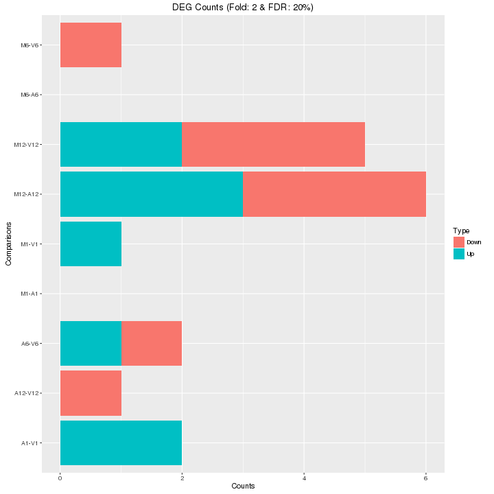

```{css, echo=FALSE}
pre code {
white-space: pre !important;
overflow-x: scroll !important;
word-break: keep-all !important;
word-wrap: initial !important;
}
```

<!--
- Compile from command-line
Rscript -e "rmarkdown::render('systemPipeRNAseq.Rmd', c('BiocStyle::html_document'), clean=F); knitr::knit('systemPipeRNAseq.Rmd', tangle=TRUE)"; Rscript ../md2jekyll.R systemPipeRNAseq.knit.md 12; Rscript -e "rmarkdown::render('systemPipeRNAseq.Rmd', c('BiocStyle::pdf_document'))"
-->

```{r style, echo = FALSE, results = 'asis'}
BiocStyle::markdown()
options(width=60, max.print=1000)
knitr::opts_chunk$set(
    eval=as.logical(Sys.getenv("KNITR_EVAL", "TRUE")),
    cache=as.logical(Sys.getenv("KNITR_CACHE", "TRUE")), 
    tidy.opts=list(width.cutoff=60), tidy=TRUE)
```

```{r setup, echo=FALSE, messages=FALSE, warnings=FALSE}
suppressPackageStartupMessages({
    library(systemPipeR)
    library(BiocParallel)
    library(Biostrings)
    library(Rsamtools)
    library(GenomicRanges)
    library(ggplot2)
    library(GenomicAlignments)
    library(ShortRead)
    library(ape)
    library(batchtools)
})
```

# Introduction

Users want to provide here background information about the design of their RNA-Seq project.

# Samples and environment settings

## Environment settings and input data

Typically, the user wants to record here the sources and versions of the
reference genome sequence along with the corresponding annotations. In
the provided sample data set all data inputs are stored in a `data`
subdirectory and all results will be written to a separate `results` directory,
while the `systemPipeRNAseq.Rmd` script and the `targets` file are expected to be located in the parent directory. The R session is expected to run from this parent directory.

To run this sample report, mini sample FASTQ and reference genome files
can be downloaded from
[here](http://biocluster.ucr.edu/~tgirke/projects/systemPipeR_test_data.zip).
The chosen data set [SRP010938](http://www.ncbi.nlm.nih.gov/sra/?term=SRP010938)
contains 18 paired-end (PE) read sets from *Arabidposis thaliana*
[@Howard2013-fq]. To minimize processing time during testing, each FASTQ
file has been subsetted to 90,000-100,000 randomly sampled PE reads that
map to the first 100,000 nucleotides of each chromosome of the *A.
thalina* genome. The corresponding reference genome sequence (FASTA) and
its GFF annotion files (provided in the same download) have been
truncated accordingly. This way the entire test sample data set is less
than 200MB in storage space. A PE read set has been chosen for this test
data set for flexibility, because it can be used for testing both types
of analysis routines requiring either SE (single end) reads or PE reads.

The following loads one of the available NGS workflow templates (here RNA-Seq)
into the user's current working directory. At the moment, the package includes
workflow templates for RNA-Seq, ChIP-Seq, VAR-Seq and Ribo-Seq. Templates for
additional NGS applications will be provided in the future.

```{r genRna_workflow, eval=FALSE}
library(systemPipeRdata)
genWorkenvir(workflow="rnaseq")
setwd("rnaseq")
```

Alternatively, this can be done from the command-line as follows:

```{sh genRna_workflow_command_line, eval=FALSE}
Rscript -e "systemPipeRdata::genWorkenvir(workflow='rnaseq')"
```

Now open the R markdown script `systemPipeRNAseq.Rmd`in your R IDE (_e.g._
vim-r or RStudio) and run the workflow as outlined below. If you work under
Vim-R-Tmux, the following command sequence will connect the user in an
interactive session with a node on the cluster. The code of the `Rmd`
script can then be sent from Vim on the login (head) node to an open R session running
on the corresponding computer node. This is important since Tmux sessions
should not be run on the computer nodes. 

```{r node_environment, eval=FALSE}
# push `F2` on your keyboard to open interactive R session
q("no") # closes R session on head node
srun --x11 --partition=intel --mem=2gb --cpus-per-task 1 --ntasks 1 --time 2:00:00 --pty bash -l
R
```

Now check whether your R session is running on a computer node of the cluster and not on a head node.

```{r r_environment, eval=FALSE}
system("hostname") # should return name of a compute node starting with i or c 
getwd() # checks current working directory of R session
dir() # returns content of current working directory
```

## Required packages and resources

The `systemPipeR` package needs to be loaded to perform the analysis steps shown in
this report [@H_Backman2016-bt].

```{r load_systempiper, eval=TRUE}
library(systemPipeR)
```

If applicable load custom functions not provided by `systemPipeR` package.

```{r source_helper_fcts, eval=FALSE}
source("systemPipeRNAseq_Fct.R")
```

## Experiment definition provided by `targets` file

The `targets` file defines all FASTQ files and sample
comparisons of the analysis workflow.

```{r load_targets, eval=TRUE}
targetspath <- system.file("extdata", "targets.txt", package="systemPipeR")
targets <- read.delim(targetspath, comment.char = "#")[,1:4]
targets
```

# Read preprocessing

## Read quality filtering and trimming

The function `preprocessReads` allows to apply predefined or custom
read preprocessing functions to all FASTQ files referenced in a
`SYSargs` container, such as quality filtering or adaptor trimming
routines.  The following example performs adaptor trimming with
the `trimLRPatterns` function from the `Biostrings` package.
After the trimming step a new targets file is generated (here
`targets_trim.txt`) containing the paths to the trimmed FASTQ files.
The new targets file can be used for the next workflow step with an updated
`SYSargs` instance, _e.g._ running the NGS alignments using the
trimmed FASTQ files.

```{r fastq_filter, eval=FALSE}
args <- systemArgs(sysma="param/trim.param", mytargets="targets.txt")
preprocessReads(args=args, Fct="trimLRPatterns(Rpattern='GCCCGGGTAA', subject=fq)",
                batchsize=100000, overwrite=TRUE, compress=TRUE)
writeTargetsout(x=args, file="targets_trim.txt", overwrite=TRUE)
```

## FASTQ quality report

The following `seeFastq` and `seeFastqPlot` functions generate and plot a series of useful 
quality statistics for a set of FASTQ files including per cycle quality box
plots, base proportions, base-level quality trends, relative k-mer
diversity, length and occurrence distribution of reads, number of reads
above quality cutoffs and mean quality distribution. The results are
written to a PDF file named `fastqReport.pdf`.

```{r fastq_report, eval=FALSE}
args <- systemArgs(sysma="param/tophat.param", mytargets="targets.txt")
fqlist <- seeFastq(fastq=infile1(args), batchsize=100000, klength=8)
pdf("./results/fastqReport.pdf", height=18, width=4*length(fqlist))
seeFastqPlot(fqlist)
dev.off()
``` 


<div align="center">Figure 1: FASTQ quality report for 18 samples</div></br>

# Alignments

## Read mapping with `Bowtie2/Tophat2` 

The NGS reads of this project will be aligned against the reference
genome sequence using `Bowtie2/TopHat2` [@Kim2013-vg; @Langmead2012-bs]. The parameter 
settings of the aligner are defined in the `tophat.param` file.

```{r tophat_alignment1, eval=FALSE}
args <- systemArgs(sysma="param/tophat.param", mytargets="targets.txt")
sysargs(args)[1] # Command-line parameters for first FASTQ file
```

Submission of alignment jobs to compute cluster, here using 72 CPU cores
(18 `qsub` processes each with 4 CPU cores).

```{r tophat_alignment2, eval=FALSE}
moduleload(modules(args))
system("bowtie2-build ./data/tair10.fasta ./data/tair10.fasta")
resources <- list(walltime=120, ntasks=1, ncpus=cores(args), memory=1024) 
reg <- clusterRun(args, conffile = ".batchtools.conf.R", Njobs=18, template = "batchtools.slurm.tmpl", runid="01", resourceList=resources)
getStatus(reg=reg) 
waitForJobs(reg=reg)  
```

## Read mapping with `HISAT2`

```{r hisat_alignment2, eval=FALSE}
args <- systemArgs(sysma="param/hisat2.param", mytargets="targets.txt")
sysargs(args)[1] # Command-line parameters for first FASTQ file
moduleload(modules(args))
system("hisat2-build ./data/tair10.fasta ./data/tair10.fasta")
resources <- list(walltime=120, ntasks=1, ncpus=cores(args), memory=1024) 
reg <- clusterRun(args, conffile = ".batchtools.conf.R", Njobs=18, template = "batchtools.slurm.tmpl", runid="01", resourceList=resources)
getStatus(reg=reg) 
waitForJobs(reg=reg)  
```

Check whether all BAM files have been created.

```{r check_files_exist, eval=FALSE}
file.exists(outpaths(args))
```

## Read and alignment stats

The following provides an overview of the number of reads in each sample
and how many of them aligned to the reference.

```{r align_stats, eval=FALSE}
read_statsDF <- alignStats(args=args) 
write.table(read_statsDF, "results/alignStats.xls", row.names=FALSE, quote=FALSE, sep="\t")
```

The following shows the alignment statistics for a sample file provided by the `systemPipeR` package. 

```{r align_stats_view, eval=TRUE}
read.table(system.file("extdata", "alignStats.xls", package="systemPipeR"), header=TRUE)[1:4,]
```

## Create symbolic links for viewing BAM files in IGV

The `symLink2bam` function creates symbolic links to view the BAM alignment files in a
genome browser such as IGV. The corresponding URLs are written to a file
with a path specified under `urlfile` in the `results` directory.

```{r bam_urls, eval=FALSE}
symLink2bam(sysargs=args, htmldir=c("~/.html/", "somedir/"), 
            urlbase="http://biocluster.ucr.edu/~tgirke/", 
	        urlfile="./results/IGVurl.txt")
```

# Read quantification

## Read counting with `summarizeOverlaps` in parallel mode using multiple cores

Reads overlapping with annotation ranges of interest are counted for
each sample using the `summarizeOverlaps` function [@Lawrence2013-kt]. The read counting is
preformed for exonic gene regions in a non-strand-specific manner while
ignoring overlaps among different genes. Subsequently, the expression
count values are normalized by *reads per kp per million mapped reads*
(RPKM). The raw read count table (`countDFeByg.xls`) and the correspoding 
RPKM table (`rpkmDFeByg.xls`) are written to separate files in the directory of this project. Parallelization is achieved with the `BiocParallel` package, here using 8 CPU cores.

```{r read_counting1, eval=FALSE}
library("GenomicFeatures"); library(BiocParallel)
txdb <- makeTxDbFromGFF(file="data/tair10.gff", format="gff", dataSource="TAIR", organism="Arabidopsis thaliana")
saveDb(txdb, file="./data/tair10.sqlite")
txdb <- loadDb("./data/tair10.sqlite")
(align <- readGAlignments(outpaths(args)[1])) # Demonstrates how to read bam file into R
eByg <- exonsBy(txdb, by=c("gene"))
bfl <- BamFileList(outpaths(args), yieldSize=50000, index=character())
multicoreParam <- MulticoreParam(workers=2); register(multicoreParam); registered()
counteByg <- bplapply(bfl, function(x) summarizeOverlaps(eByg, x, mode="Union", 
                                               ignore.strand=TRUE, 
                                               inter.feature=FALSE, 
                                               singleEnd=TRUE)) 
countDFeByg <- sapply(seq(along=counteByg), function(x) assays(counteByg[[x]])$counts)
rownames(countDFeByg) <- names(rowRanges(counteByg[[1]])); colnames(countDFeByg) <- names(bfl)
rpkmDFeByg <- apply(countDFeByg, 2, function(x) returnRPKM(counts=x, ranges=eByg))
write.table(countDFeByg, "results/countDFeByg.xls", col.names=NA, quote=FALSE, sep="\t")
write.table(rpkmDFeByg, "results/rpkmDFeByg.xls", col.names=NA, quote=FALSE, sep="\t")
```

Sample of data slice of count table

```{r view_counts, eval=FALSE}
read.delim("results/countDFeByg.xls", row.names=1, check.names=FALSE)[1:4,1:5]
```

Sample of data slice of RPKM table

```{r view_rpkm, eval=FALSE}
read.delim("results/rpkmDFeByg.xls", row.names=1, check.names=FALSE)[1:4,1:4]
```

Note, for most statistical differential expression or abundance analysis
methods, such as `edgeR` or `DESeq2`, the raw count values should be used as input. The
usage of RPKM values should be restricted to specialty applications
required by some users, *e.g.* manually comparing the expression levels
among different genes or features.

## Sample-wise correlation analysis

The following computes the sample-wise Spearman correlation coefficients from
the `rlog` transformed expression values generated with the `DESeq2` package. After
transformation to a distance matrix, hierarchical clustering is performed with
the `hclust` function and the result is plotted as a dendrogram
(also see file `sample_tree.pdf`).

```{r sample_tree, eval=FALSE}
library(DESeq2, quietly=TRUE); library(ape,  warn.conflicts=FALSE)
countDF <- as.matrix(read.table("./results/countDFeByg.xls"))
colData <- data.frame(row.names=targetsin(args)$SampleName, condition=targetsin(args)$Factor)
dds <- DESeqDataSetFromMatrix(countData = countDF, colData = colData, design = ~ condition)
d <- cor(assay(rlog(dds)), method="spearman")
hc <- hclust(dist(1-d))
pdf("results/sample_tree.pdf")
plot.phylo(as.phylo(hc), type="p", edge.col="blue", edge.width=2, show.node.label=TRUE, no.margin=TRUE)
dev.off()
```


<div align="center">Figure 2: Correlation dendrogram of samples</div></br>

# Analysis of DEGs

The analysis of differentially expressed genes (DEGs) is performed with
the glm method of the `edgeR` package [@Robinson2010-uk]. The sample
comparisons used by this analysis are defined in the header lines of the 
`targets.txt` file starting with `<CMP>`.

## Run `edgeR`

```{r run_edger, eval=FALSE}
library(edgeR)
countDF <- read.delim("results/countDFeByg.xls", row.names=1, check.names=FALSE) 
targets <- read.delim("targets.txt", comment="#")
cmp <- readComp(file="targets.txt", format="matrix", delim="-")
edgeDF <- run_edgeR(countDF=countDF, targets=targets, cmp=cmp[[1]], independent=FALSE, mdsplot="")
```

Add gene descriptions

```{r custom_annot, eval=FALSE}
library("biomaRt")
m <- useMart("plants_mart", dataset="athaliana_eg_gene", host="plants.ensembl.org")
desc <- getBM(attributes=c("tair_locus", "description"), mart=m)
desc <- desc[!duplicated(desc[,1]),]
descv <- as.character(desc[,2]); names(descv) <- as.character(desc[,1])
edgeDF <- data.frame(edgeDF, Desc=descv[rownames(edgeDF)], check.names=FALSE)
write.table(edgeDF, "./results/edgeRglm_allcomp.xls", quote=FALSE, sep="\t", col.names = NA)
```

## Plot DEG results

Filter and plot DEG results for up and down regulated genes. The
definition of *up* and *down* is given in the corresponding help
file. To open it, type `?filterDEGs` in the R console.

```{r filter_degs, eval=FALSE}
edgeDF <- read.delim("results/edgeRglm_allcomp.xls", row.names=1, check.names=FALSE) 
pdf("results/DEGcounts.pdf")
DEG_list <- filterDEGs(degDF=edgeDF, filter=c(Fold=2, FDR=20))
dev.off()
write.table(DEG_list$Summary, "./results/DEGcounts.xls", quote=FALSE, sep="\t", row.names=FALSE)
```


<div align="center">Figure 3: Up and down regulated DEGs with FDR of 1%</div></br>

## Venn diagrams of DEG sets

The `overLapper` function can compute Venn intersects for large numbers of sample
sets (up to 20 or more) and plots 2-5 way Venn diagrams. A useful
feature is the possiblity to combine the counts from several Venn
comparisons with the same number of sample sets in a single Venn diagram
(here for 4 up and down DEG sets).

```{r venn_diagram, eval=FALSE}
vennsetup <- overLapper(DEG_list$Up[6:9], type="vennsets")
vennsetdown <- overLapper(DEG_list$Down[6:9], type="vennsets")
pdf("results/vennplot.pdf")
vennPlot(list(vennsetup, vennsetdown), mymain="", mysub="", colmode=2, ccol=c("blue", "red"))
dev.off()
```


<div align="center">Figure 4: Venn Diagram for 4 Up and Down DEG Sets</div></br>

# GO term enrichment analysis

## Obtain gene-to-GO mappings

The following shows how to obtain gene-to-GO mappings from `biomaRt` (here for *A.
thaliana*) and how to organize them for the downstream GO term
enrichment analysis. Alternatively, the gene-to-GO mappings can be
obtained for many organisms from Bioconductor’s `*.db` genome annotation
packages or GO annotation files provided by various genome databases.
For each annotation this relatively slow preprocessing step needs to be
performed only once. Subsequently, the preprocessed data can be loaded
with the `load` function as shown in the next subsection.

```{r get_go_annot, eval=FALSE}
library("biomaRt")
listMarts() # To choose BioMart database
listMarts(host="plants.ensembl.org")
m <- useMart("plants_mart", host="plants.ensembl.org")
listDatasets(m)
m <- useMart("plants_mart", dataset="athaliana_eg_gene", host="plants.ensembl.org")
listAttributes(m) # Choose data types you want to download
go <- getBM(attributes=c("go_id", "tair_locus", "namespace_1003"), mart=m)
go <- go[go[,3]!="",]; go[,3] <- as.character(go[,3])
go[go[,3]=="molecular_function", 3] <- "F"; go[go[,3]=="biological_process", 3] <- "P"; go[go[,3]=="cellular_component", 3] <- "C"
go[1:4,]
dir.create("./data/GO")
write.table(go, "data/GO/GOannotationsBiomart_mod.txt", quote=FALSE, row.names=FALSE, col.names=FALSE, sep="\t")
catdb <- makeCATdb(myfile="data/GO/GOannotationsBiomart_mod.txt", lib=NULL, org="", colno=c(1,2,3), idconv=NULL)
save(catdb, file="data/GO/catdb.RData")
```

## Batch GO term enrichment analysis

Apply the enrichment analysis to the DEG sets obtained the above differential
expression analysis. Note, in the following example the `FDR` filter is set
here to an unreasonably high value, simply because of the small size of the toy
data set used in this vignette. Batch enrichment analysis of many gene sets is
performed with the function. When `method=all`, it returns all GO terms passing
the p-value cutoff specified under the `cutoff` arguments. When `method=slim`,
it returns only the GO terms specified under the `myslimv` argument. The given
example shows how a GO slim vector for a specific organism can be obtained from
BioMart.

```{r go_enrich, eval=FALSE}
library("biomaRt")
load("data/GO/catdb.RData")
DEG_list <- filterDEGs(degDF=edgeDF, filter=c(Fold=2, FDR=50), plot=FALSE)
up_down <- DEG_list$UporDown; names(up_down) <- paste(names(up_down), "_up_down", sep="")
up <- DEG_list$Up; names(up) <- paste(names(up), "_up", sep="")
down <- DEG_list$Down; names(down) <- paste(names(down), "_down", sep="")
DEGlist <- c(up_down, up, down)
DEGlist <- DEGlist[sapply(DEGlist, length) > 0]
BatchResult <- GOCluster_Report(catdb=catdb, setlist=DEGlist, method="all", id_type="gene", CLSZ=2, cutoff=0.9, gocats=c("MF", "BP", "CC"), recordSpecGO=NULL)
library("biomaRt")
m <- useMart("plants_mart", dataset="athaliana_eg_gene", host="plants.ensembl.org")
goslimvec <- as.character(getBM(attributes=c("goslim_goa_accession"), mart=m)[,1])
BatchResultslim <- GOCluster_Report(catdb=catdb, setlist=DEGlist, method="slim", id_type="gene", myslimv=goslimvec, CLSZ=10, cutoff=0.01, gocats=c("MF", "BP", "CC"), recordSpecGO=NULL)
```

## Plot batch GO term results

The `data.frame` generated by `GOCluster` can be plotted with the `goBarplot` function. Because of the
variable size of the sample sets, it may not always be desirable to show
the results from different DEG sets in the same bar plot. Plotting
single sample sets is achieved by subsetting the input data frame as
shown in the first line of the following example.

```{r go_plot, eval=FALSE}
gos <- BatchResultslim[grep("M6-V6_up_down", BatchResultslim$CLID), ]
gos <- BatchResultslim
pdf("GOslimbarplotMF.pdf", height=8, width=10); goBarplot(gos, gocat="MF"); dev.off()
goBarplot(gos, gocat="BP")
goBarplot(gos, gocat="CC")
```


<div align="center">Figure 5: GO Slim Barplot for MF Ontology</div></br>

# Clustering and heat maps

The following example performs hierarchical clustering on the `rlog`
transformed expression matrix subsetted by the DEGs identified in the above
differential expression analysis. It uses a Pearson correlation-based distance
measure and complete linkage for cluster joining.

```{r heatmap, eval=FALSE}
library(pheatmap)
geneids <- unique(as.character(unlist(DEG_list[[1]])))
y <- assay(rlog(dds))[geneids, ]
pdf("heatmap1.pdf")
pheatmap(y, scale="row", clustering_distance_rows="correlation", clustering_distance_cols="correlation")
dev.off()
```


<div align="center">Figure 6: Heat Map with Hierarchical Clustering Dendrograms of DEGs</div></br>

# Version Information

```{r sessionInfo}
sessionInfo()
```

# Funding

This project was supported by funds from the National Institutes of Health (NIH).

# References
