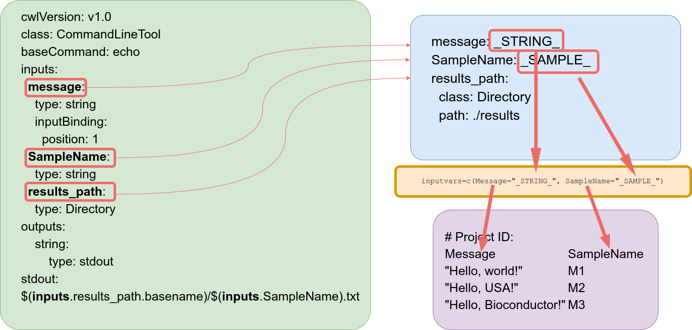

```{r, include=FALSE}
knitr::opts_chunk$set(echo = TRUE)
```

```{r load_library, eval=TRUE, include=FALSE}
library(systemPipeR)
```

# Introduction

A central concept for designing workflows within the `systemPipeR` environment is 
the use of workflow management containers. `systemPipeR` adopted the widely used community standard [Common Workflow Language](https://www.commonwl.org/) (CWL) 
[@Amstutz2016-ka] for describing analysis workflows in a generic and reproducible 
manner.
Using this community standard in `systemPipeR` has many advantages. For instance, 
the integration of CWL allows running `systemPipeR` workflows from a single 
specification instance either entirely from within R, from various command line 
wrappers (e.g., cwl-runner) or from other languages (, e.g., Bash or Python). 
`systemPipeR` includes support for both command line and R/Bioconductor software 
as well as resources for containerization, parallel evaluations on computer 
clusters along with the automated generation of interactive analysis reports.

An important feature of `systemPipeR's` CWL interface is that it provides two 
options to run command line tools and workflows based on CWL. 
First, one can run CWL in its native way via an R-based wrapper utility for 
`cwl-runner` or `cwl-tools` (CWL-based approach). Second, one can run workflows 
using CWL's command line and workflow instructions from within R (R-based approach). 
In the latter case the same CWL workflow definition files (e.g. *.cwl* and *.yml*) 
are used but rendered and executed entirely with R functions defined by `systemPipeR`, 
and thus use CWL mainly as a command line and workflow definition format rather 
than software to run workflows. In this regard `systemPipeR` also provides several 
convenience functions that are useful for designing and debugging workflows, 
such as a command line rendering function to retrieve the exact command line 
strings for each data set and processing step prior to running a command line.

This overview introduces how CWL describes command line tools and how to connect 
them to create workflows. In addition, we will demonstrate how the workflow can
be easily scalable with `systemPipeR.`

# CWL command line specifications

CWL command line specifications are written in [YAML](http://yaml.org/) format.

In CWL, files with the extension `.cwl` define the parameters of a chosen 
command line step or workflow, while files with the extension `.yml` define 
the input variables of command line steps. 

## CWL `CommandLineTool`

`CommandLineTool` by CWL definition is a standalone process, with no interaction 
if other programs, execute a program, and produce output. 

Let's explore the `.cwl` file: 

```{r}
dir_path <- system.file("extdata/cwl", package="systemPipeR")
cwl <- yaml::read_yaml(file.path(dir_path, "example/example.cwl"))
```

- The `cwlVersion` component shows the CWL specification version used by the document. 
- The `class` component shows this document describes a `CommandLineTool.`
Note that CWL has another `class`, called `Workflow` which represents a union of one 
or more command line tools together. 

```{r}
cwl[1:2]
```

- `baseCommand` component provides the name of the software that we desire to execute.

```{r}
cwl[3]
```

- The `inputs` section provides the input information to run the tool. Important 
components of this section are: 
    - `id`: each input has an id describing the input name;
    - `type`: describe the type of input value (string, int, long, float, double, 
    File, Directory or Any);
    - `inputBinding`: It is optional. This component indicates if the input 
    parameter should appear on the command line. If this component is missing 
    when describing an input parameter, it will not appear in the command line 
    but can be used to build the command line.

```{r}
cwl[4]
```

- The `outputs` section should provide a list of the expected outputs after running the command line tools. Important 
components of this section are: 
    - `id`: each input has an id describing the output name;
    - `type`: describe the type of output value (string, int, long, float, double, 
    File, Directory, Any or `stdout`);
    - `outputBinding`: This component defines how to set the outputs values. The `glob` component will define the name of the output value. 

```{r}
cwl[5]
```

- `stdout`: component to specify a `filename` to capture standard output.
Note here we are using a syntax that takes advantage of the inputs section, 
using results_path parameter and also the `SampleName` to construct the output `filename.` 

```{r}
cwl[6]
```

## CWL `Workflow`

`Workflow` class in CWL is defined by multiple process steps, where can have interdependencies between the steps, and the output for one step can be used as input in the further steps.  

```{r}
cwl.wf <- yaml::read_yaml(file.path(dir_path, "example/workflow_example.cwl"))
```

- The `cwlVersion` component shows the CWL specification version used by the document. 
- The `class` component shows this document describes a `Workflow`.

```{r}
cwl.wf[1:2]
```

- The `inputs` section describes the inputs of the workflow.

```{r}
cwl.wf[3]
```

- The `outputs` section describes the outputs of the workflow.

```{r}
cwl.wf[4]
```

- The `steps` section describes the steps of the workflow. In this simple example, 
we demonstrate one step.

```{r}
cwl.wf[5]
```

## CWL Input Parameter 

Next, let's explore the *.yml* file, which provide the input parameter values for all
the components we describe above. 

For this simple example, we have three parameters defined:

```{r}
yaml::read_yaml(file.path(dir_path, "example/example_single.yml"))
```

Note that if we define an input component in the *.cwl* file, this value needs 
to be also defined here in the *.yml* file. 

## How to connect CWL description files within `systemPipeR`

`SYSargsList` container stores all the information and instructions needed for processing 
a set of input files with a single or many command-line steps within a workflow 
(i.e. several components of the software or several independent software tools). 
The `SYSargsList` object is created and fully populated with the `SYSargsList` construct
function.

The following imports a `.cwl` file (here `example.cwl`) for running the `echo Hello World` 
example.

```{r fromFile, eval=TRUE}
HW <- SYSargsList(wf_file="example/workflow_example.cwl", 
                  input_file="example/example_single.yml", dir_path = dir_path)
HW
cmdlist(HW)
```

However, we are limited to run just one command line or one sample in this example. 
To scale the command line over many samples, a simple solution offered by `systemPipeR` 
is to provide a `variable` for each of the parameters that we want to run with multiple samples. 

Let's explore the example:

```{r}
yml <- yaml::read_yaml(file.path(dir_path, "example/example.yml"))
yml
```

For the `message` and `SampleName` parameter, we are passing a variable connecting 
with a third file called `targets.` 

Now, let's explore the `targets` file structure:

```{r}
targetspath <- system.file("extdata/cwl/example/targets_example.txt", package="systemPipeR")
read.delim(targetspath, comment.char = "#")
```

The `targets` file defines all input files or values and sample ids of an analysis workflow. 
For this example, we have defined a string message for the `echo` command line tool,
in the first column that will be evaluated, 
and the second column is the `SampleName` id for each one of the messages.
Any number of additional columns can be added as needed.

Users should note here, the usage of `targets` files is optional when using 
`systemPipeR's` new CWL interface. Since for organizing experimental variables targets 
files are extremely useful and user-friendly. Thus, we encourage users to keep using them.

> Important!

When the target file is provided, the only column required is `SampleName.` 
The reason for this is that, internally, `SampleName` is used to construct the object, 
and hence mandatory.

### How to connect the parameter files and `targets` file information?

The constructor function creates an `SYSargsList` S4 class object connecting three input files:

    - CWL command line specification file (`wf_file` argument);
    - Input variables (`input_file` argument);
    - Targets file (`targets` argument).
    
As demonstrated above, the latter is optional for workflow steps lacking input files. 
The connection between input variables (here defined by `input_file` argument) 
and the `targets` file are defined under the `inputvars` argument. 
A named vector is required, where each element name needs to match with column 
names in the `targets` file, and the value must match the names of the *.yml* 
variables. This is used to replace the CWL variable and construct all the command-line
for that particular step. 

The variable pattern `_XXXX_` is used to distinguish CWL variables that target 
columns will replace. This pattern is recommended for consistency and easy identification
but not enforced.

The following imports a `.cwl` file (same example demonstrated above) for running
the `echo Hello World` example. However, now we are connecting the variable defined 
on the `.yml` file with the `targets` file inputs.

```{r fromFile_example, eval=TRUE}
HW_mul <- SYSargsList(step_name = "echo", 
                      targets=targetspath, 
                      wf_file="example/workflow_example.cwl", input_file="example/example.yml", 
                      dir_path = dir_path, 
                      inputvars = c(Message = "_STRING_", SampleName = "_SAMPLE_"))
HW_mul
cmdlist(HW_mul)
```



# Creating the CWL param files from the command line

Users need to define the command line in a pseudo-bash script format:

```{r cmd, eval=TRUE}
command <- "
hisat2 \
    -S <F, out: ./results/M1A.sam> \
    -x <F: ./data/tair10.fasta> \
     -k <int: 1> \
    -min-intronlen <int: 30> \
    -max-intronlen <int: 3000> \
    -threads <int: 4> \
    -U <F: ./data/SRR446027_1.fastq.gz>
"
```

## Define prefix and defaults

- First line is the base command. Each line is an argument with its default value.

- For argument lines (starting from the second line), any word before the first 
  space with leading `-` or `--` in each will be treated as a prefix, like `-S` or 
  `--min`. Any line without this first word will be treated as no prefix. 
  
- All defaults are placed inside `<...>`.

- First argument is the input argument type. `F` for "File", "int", "string" are unchanged.

- Optional: use the keyword `out` followed the type with a `,` comma separation to 
  indicate if this argument is also an CWL output.
  
- Then, use `:` to separate keywords and default values, any non-space value after the `:`
  will be treated as the default value. 
  
- If any argument has no default value, just a flag, like `--verbose`, there is no need to add any `<...>`

## `createParamFiles` Function

`createParamFiles` function requires the `string` as defined above as an input. 

First of all, the function will print the three components of the `cwl` file:
    - `BaseCommand`: Specifies the program to execute. 
    - `Inputs`: Defines the input parameters of the process.
    - `Outputs`: Defines the parameters representing the output of the process.
    
The four component is the original command line.

If in interactive mode, the function will verify that everything is correct and 
will ask you to proceed. Here, the user can answer "no" and provide more 
information at the string level. Another question is to save the param created here.

If running the workflow in non-interactive mode, the `createParamFiles` function will 
consider "yes" and returning the container.

```{r}
cmd <- createParamFiles(command, writeParamFiles = FALSE) 
```

If the user chooses not to save the `param` files on the above operation, 
it can use the `writeParamFiles` function.

```{r saving, eval=FALSE}
writeParamFiles(cmd, overwrite = TRUE)
```

## How to access and edit param files

### Print a component

```{r}
printParam(cmd, position = "baseCommand") ## Print a baseCommand section
printParam(cmd, position = "outputs")
printParam(cmd, position = "inputs", index = 1:2) ## Print by index
printParam(cmd, position = "inputs", index = -1:-2) ## Negative indexing printing to exclude certain indices in a position
```

### Subsetting the command line

```{r}
cmd2 <- subsetParam(cmd, position = "inputs", index = 1:2, trim = TRUE)
cmdlist(cmd2)

cmd2 <- subsetParam(cmd, position = "inputs", index = c("S", "x"), trim = TRUE)
cmdlist(cmd2)
```

### Replacing a existing argument in the command line

```{r}
cmd3 <- replaceParam(cmd, "base", index = 1, replace = list(baseCommand = "bwa"))
cmdlist(cmd3)
```

```{r}
new_inputs <- new_inputs <- list(
    "new_input1" = list(type = "File", preF="-b", yml ="myfile"),
    "new_input2" = "-L <int: 4>"
)
cmd4 <- replaceParam(cmd, "inputs", index = 1:2, replace = new_inputs)
cmdlist(cmd4)
```

### Adding new arguments

```{r}
newIn <- new_inputs <- list(
    "new_input1" = list(type = "File", preF="-b1", yml ="myfile1"),
    "new_input2" = list(type = "File", preF="-b2", yml ="myfile2"),
    "new_input3" = "-b3 <F: myfile3>"
)
cmd5 <- appendParam(cmd, "inputs", index = 1:2, append = new_inputs)
cmdlist(cmd5)

cmd6 <- appendParam(cmd, "inputs", index = 1:2, after=0, append = new_inputs)
cmdlist(cmd6)
```

### Editing `output` param

```{r}
new_outs <- list(
    "sam_out" = "<F: $(inputs.results_path)/test.sam>"
) 
cmd7 <- replaceParam(cmd, "outputs", index = 1, replace = new_outs)
output(cmd7) 
```

### Internal Check

```{r sysargs2, eval=TRUE}
cmd <- "
hisat2 \
    -S <F, out: _SampleName_.sam> \
    -x <F: ./data/tair10.fasta> \
    -k <int: 1> \
    -min-intronlen <int: 30> \
    -max-intronlen <int: 3000> \
    -threads <int: 4> \
    -U <F: _FASTQ_PATH1_>
"
WF <- createParamFiles(cmd, overwrite = TRUE, writeParamFiles = TRUE) 
targetspath <- system.file("extdata", "targets.txt", package = "systemPipeR")
WF_test <- loadWorkflow(targets = targetspath, wf_file="hisat2.cwl",
                   input_file="hisat2.yml", dir_path = "param/cwl/hisat2/")
WF_test <- renderWF(WF_test, inputvars = c(FileName = "_FASTQ_PATH1_", SampleName = "_SampleName_"))
WF_test
cmdlist(WF_test)[1]
```

# Version information

```{r sessionInfo}
sessionInfo()
```

# Funding

This project is funded by NSF award [ABI-1661152](https://www.nsf.gov/awardsearch/showAward?AWD_ID=1661152). 

# References
