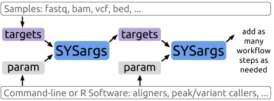

```{r, include=FALSE}
knitr::opts_chunk$set(echo = TRUE)
```

```{r load_library, eval=TRUE, include=FALSE}
library(systemPipeR)
```

# Introduction

A central concept for designing workflows within the `systemPipeR` environment
is the use of workflow management containers. Workflow management containers
allow the automation of design, build, run and scale different steps and tools
in data analysis.

The flexibility of *`systemPipeR's`* new interface workflow control class is the
driving factor behind the use of as many steps necessary for the analysis, as
well as the connection between command-line- or R-based software.

# Workflow design structure using `SYSargsList`

The flexibility of `systemPipeR's` new interface workflow management class is
the driving factor behind the use of as many steps necessary for the analysis,
as well as the connection between command-line- or R-based software. The
connectivity among all workflow steps is achieved by the `SYSargsList` workflow
management class.

This S4 class is a list-like container where each instance stores all the
input/output paths and parameter components required for a particular data
analysis step.

A key aspect of the `SYSargsList` class is the coordination of the input/output
paths and command-line parameter when subsetting.

When running preconfigured workflows, the only input the user needs to provide
is the initial *targets* file containing the paths to the input files (*e.g.*
FASTQ) along with unique sample labels. Subsequent targets instances are created
automatically. The parameters required for running command-line software is
provided by the parameter (*.cwl*) files described below.

# How to design a Workflow?

## Project Initialization

### Directory Structure

# Interactive Workflow

To create a Workflow within `systemPipeR`, we can start by defining an empty
container and checking the directory structure:

```{r SPRproject, eval=TRUE}
#sal <- SPRproject(projPath = tempdir()) 
sal <- SPRproject() 
```

Internally, `SPRproject` function will check and/or create the basic folder
structure, which means `data`, `param`, and `results` folder. 
If the user wants to use a different names for these directories, can be specified 
as follows:

```{r SPRproject_dir, eval=FALSE}
sal <- SPRproject(projPath = getwd(), data = "data", param = "param", results = "results") 
```

Also, this function allows creating a hidden folder called `.SPRproject`, by default,
to store all the log files.
A yaml file, here called `SYSargsList.yml`, has been created, which initially
contains the basic location of the project structure; however, everytime the object in R 
is updated, the new information will also be store in this file, for easy recover.
If you desire a different names for the logs folder and the yaml files, those can be 
modify as follows:

```{r SPRproject_logs, eval=FALSE}
sal <- SPRproject(logs.dir= "SPRproject", sys.file="SPRproject/SYSargsList.yml") 
```

In this stage, the object `sal` is a empty container, except the project
information, as the project, data, results and param folder paths, as can be
access but the `projectWF` accessory method:

```{r}
sal
projectWF(sal)
```

Also, the length function will return how many steps this workflow contains and
in this case it is empty, as follow:

```{r}
length(sal)
```

## Adding a new step from template

Next, we need to populate the object created with the first step in the
workflow. Here, an example of how to perform this task using param template
files for trimming FASTQ files with `Trimmomatic` software (citation).

The constructor functions create an `SYSargsList` S4 class object from three
input files:

    - CWL command-line specification file (`wf_file` argument);
    - Input variables (`input_file` argument);
    - Targets file (`targets` argument).

The latter is optional for workflow steps lacking input files. The connection
between input variables and the targets file are defined under the `inputvars`
argument. It is required a named vector, where each element name needs to match
with column names in the targets file and the value must match the names of the
*.yml* variables.

In CWL, files with the extension `.cwl` define the parameters of a chosen
command-line step or workflow, while files with the extension `.yml` define the
input variables of command-line steps. Note, input variables provided by a
targets file can be passed on to a instance via the `inputvars` argument of the
`SYSargsList` function.

For more information of each one of those files, please check here. (\#\#TODO:
Link to the dedicate section explaining the dynamic between those 3 files).

```{r}
targetspath <- system.file("extdata", "targetsPE.txt", package = "systemPipeR")
appendStep(sal) <- SYSargsList(targets=targetspath, 
                   step_name="Quality",
                   wf_file = "trimmomatic/trimmomatic-pe.cwl", input_file = "trimmomatic/trimmomatic-pe.yml",
                   dir_path=system.file("extdata/cwl", 
                                        package = "systemPipeR"),
                   inputvars=c(FileName1="_FASTQ_PATH1_", FileName2="_FASTQ_PATH2_", SampleName="_SampleName_"))
```

-   Append Step in the specific order

```{r}
appendStep(sal, after=0) <- SYSargsList(targets=targetspath, 
                                        step_name="Quality2",
                                        wf_file = "trimmomatic/trimmomatic-pe.cwl", input_file = "trimmomatic/trimmomatic-pe.yml",
                                        dir_path=system.file("extdata/cwl", package = "systemPipeR"),
                                        inputvars=c(FileName1="_FASTQ_PATH1_", FileName2="_FASTQ_PATH2_", SampleName="_SampleName_"))
```

### Accessing the details

Let's explore our object:

-   Accessor Methods:

Several accessor methods are available that are named after the slot names of
the `SYSargsList` object.

```{r}
names(sal)
```

-   Check the length of the `sal` object:

```{r}
length(sal)
```

-   The `SYSargsList` class and its subsetting operator `[`:

```{r}
sal[1]
stepsWF(sal)$Quality
```

- The `SYSargsList` class and its subsetting input samples: 

```{r}
sal_sub <- subsetTargets(sal[1], 1:3)
stepsWF(sal_sub)
targetsWF(sal_sub)
outfiles(sal_sub)
```

- The `SYSargsList` class and its operator `+`:

```{r, eval=FALSE}
sal[1] + sal[2]
```

- Checking the expected output files:

The `outfiles` components of `SYSargsList` define the expected output files for
each step in the workflow; some of which are the input for the next workflow
step.

```{r}
##outfiles slot
outfiles(sal)
```

- Checking the input files by the `targetsWF()`:

```{r}
targetsWF(sal)
```

- Checking the command-line for each sample:

`cmdlist()` method constructs the system commands for running command-line
software as specified by a given `.cwl` file combined with the paths to the
input samples (e.g. FASTQ files) provided by a `targets` file. The example below
shows the `cmdlist()` output for running Trimmomatic on the first PE read
sample. Evaluating the output of `cmdlist()` can be very helpful for designing
and debugging `.cwl` files of new command-line software or changing the
parameter settings of existing ones.

```{r}
sal[1]
cmdlist(sal[1], 1:2)
```

-   Rename a Step

```{r}
renameStep(sal, 1) <- "newStep"
renameStep(sal, c(1, 2)) <- c("newStep", "new")
sal
names(outfiles(sal[1:2]))
names(targetsWF(sal[1:2]))
```

-   Replace a Step

```{r}
replaceStep(sal, 1) <- sal[2]
replaceStep(sal, 1, step_name="Quality") <- sal[2]
sal
```

- Removing a Step

```{r}
sal <- sal[-2]
sal
```

### Internal

- out of bounds

```{r, eval=FALSE}
sal[3]
```

## Adding more Steps

The `appendStep()` method helps to add a new step in a interactive way.

```{r}
appendStep(sal) <- SYSargsList(step_name = "Index", 
                               targets=NULL, 
                               wf_file = "hisat2/hisat2-index.cwl", input_file="hisat2/hisat2-index.yml",
                               dir_path=system.file("extdata/cwl", package = "systemPipeR"),
                               dependency=NULL)
cmdlist(sal[2])
```

```{r, eval=FALSE}
subsetTargets(sal[1], 1:5) ## TODO:error message
```

Important: The number of the samples in which step subset needs to be equal, otherwise, 
we will have an error. 

### Use the output files for the next step

Here, in this example, we would like to use the output from Quality Step, as
input from the next step, which is the Mapping. In this case, let's look the
output from the first step:

```{r}
outfiles(sal[1])
```

The two-column you may want to use here are "trimmomatic_1\_paired" and
"trimmomatic_2\_paired". For the argument `targets` in the `SYSargsList` function,
should provide the name of the correspondent step in the Workflow and also which
output you would like to be incorporated on the next step. Here, the name of the
columns we previously explore above. It is possible to keep all the original
columns from the `targets` files or remove some columns for a clean `targets` file.
The argument `rm_targets_col` provides this flexibility, where it is possible to
specify the names of the columns that should be removed. If no names are passing
here, the new columns will be appended. The argument `inputvars` allow the
connectivity between the new targets file. Here, the name of the previous
`outfiles` should be provided it.

```{r, eval=TRUE}
appendStep(sal) <- SYSargsList(targets=targetspath,
                               step_name="Mapping",
                               wf_file = "hisat2/hisat2-mapping-pe.cwl", 
                               input_file="hisat2/hisat2-mapping-pe.yml",
                               dir_path=system.file("extdata/cwl", package = "systemPipeR"),
                               inputvars=c(FileName1="_FASTQ_PATH1_", 
                                           FileName2="_FASTQ_PATH2_", SampleName="_SampleName_"),
                               dependency = c("Quality", "Index"))
# appendStep(sal) <- SYSargsList(targets=targetspath,
#                                step_name="Mapping",
#                                wf_file = "workflow-hisat2/workflow_hisat2-pe.cwl", 
#                                input_file="workflow-hisat2/workflow_hisat2-pe.yml",
#                                dir_path=system.file("extdata/cwl", package = "systemPipeR"),
#                                inputvars=c(trimmomatic_1_paired="_FASTQ_PATH1_", 
#                                            trimmomatic_2_paired="_FASTQ_PATH2_", SampleName="_SampleName_"),
#                                rm_targets_col = c("FileName1", "FileName2"),
#                                dependency = c("Quality", "Index"))
```

### Subset Command Lines

```{r, eval=FALSE}
sal[1]
sal[]

cmdlist(sal[1])
cmdlist(sal[2])
cmdlist(sal[3], 1) 
cmdlist(sal[c(1,3)], 1:2)
```

### 

```{r}
sal_sub <- subsetTargets(sal[c(1,3)], input_sample = 1)
stepsWF(sal_sub)
```

## Update a parameter the workflow

```{r, eval=TRUE}
## check values
yamlinput(sal[1])
## check on command line
cmdlist(sal[1], 1)
## Replace
yamlinput(sal, "thread") <- c(4, 5, 6, rep(20, 15)) ## TODO
sal
## check NEW values
yamlinput(sal[1])
## Check on command line
cmdlist(sal[1], 1)
```

## Adding a R code as new Step

```{r}
appendStep(sal) <- LineWise("1+1", "R_code2")
sal
stepsWF(sal)
```

- Replacement and Append methods for R Code Steps

```{r, sal_lw_rep, eval=TRUE}
appendCodeLine(sal, step=4, after=1) <- "66+55"
codeLine(sal[4])

replaceCodeLine(sal, step=4, line=1) <- "5+5"
codeLine(sal[4])
```

For more details about the `LineWise` class, please check [below](#linewise).

# Create Workflow from R Markdown

```{r, eval=FALSE}
file_path <- system.file("extdata/", "systemPipeTEST.Rmd", package="systemPipeR")
# "../systemPipeR/inst/extdata/systemPipeTEST.Rmd"
sal_rmd <- importWF(file_path)
sal_rmd
stepsWF(sal_rmd)
dependency(sal_rmd)
codeLine(sal_rmd[3])
```

# Running the workflow

```{r, eval=FALSE}
runWF(sal[1])
```

## Details

- To include a particular code chunk from the R Markdown file in the workflow
    analysis, please use the following code chunk options:

    -   `spr = 'r'`: for code chunks with R code lines;
    -   `spr = 'sysargs'`: for code chunks with an `SYSargsList` object;
    -   `spr.dep = <StepName>`: for specify the previous dependency.

-   For `spr = 'sysargs'`, the last object assigned needs to be the
    `SYSargsList`, for example:

```{r fromFile_example, eval=TRUE}
targetspath <- system.file("extdata/cwl/example/targets_example.txt", package="systemPipeR")
HW_mul <- SYSargsList(step_name = "Example", 
                      targets=targetspath, 
                      wf_file="example/example.cwl", input_file="example/example.yml", 
                      dir_path = system.file("extdata/cwl", package="systemPipeR"), 
                      inputvars = c(Message = "_STRING_", SampleName = "_SAMPLE_"))
```

Also, note that all the required files to generate this particular object needed
to be defined in the code chunk. The motivation for this is that when R Markdown
files will be imported, and this code chunk will be evaluated and stored in the
workflow control class as the `SYSargsList` object.

# Internal Classes

`SYSargsList` steps are can be defined with two inner classes, `SYSargs2` and
`LineWise`. Next, more details on both classes.

## `SYSargs2` Class {#sysargs2}

*`SYSargs2`* workflow control class, an S4 class, is a list-like container where
each instance stores all the input/output paths and parameter components
required for a particular data analysis step. *`SYSargs2`* instances are
generated by two constructor functions, *loadWF* and *renderWF*, using as data
input *targets* or *yaml* files as well as two *cwl* parameter files (for
details see below).

In CWL, files with the extension *`.cwl`* define the parameters of a chosen
command-line step or workflow, while files with the extension *`.yml`* define
the input variables of command-line steps. Note, input variables provided by a
*targets* file can be passed on to a *`SYSargs2`* instance via the *inputvars*
argument of the *renderWF* function.

The following imports a *`.cwl`* file (here *`hisat2-mapping-se.cwl`*) for
running the short read aligner HISAT2 [@Kim2015-ve]. For more details about the
file structure and how to design or customize our own software tools, please
check `systemPipeR and CWL` pipeline.

```{r sysargs2_cwl_structure, echo = FALSE, eval=FALSE}
hisat2.cwl <- system.file("extdata", "cwl/hisat2/hisat2-mapping-se.cwl", package="systemPipeR")
yaml::read_yaml(hisat2.cwl)
```

```{r sysargs2_yaml_structure, echo = FALSE, eval=FALSE}
hisat2.yml <- system.file("extdata", "cwl/hisat2/hisat2-mapping-se.yml", package="systemPipeR")
yaml::read_yaml(hisat2.yml)
```

The *loadWF* and *renderWF* functions render the proper command-line strings for
each sample and software tool.

```{r SYSargs2_structure, eval=TRUE}
library(systemPipeR)
targetspath <- system.file("extdata", "targets.txt", package="systemPipeR")
dir_path <- system.file("extdata/cwl", package="systemPipeR")
WF <- loadWF(targets=targetspath, wf_file="hisat2/hisat2-mapping-se.cwl",
                   input_file="hisat2/hisat2-mapping-se.yml",
                   dir_path=dir_path)

WF <- renderWF(WF, inputvars=c(FileName="_FASTQ_PATH1_", SampleName="_SampleName_"))
```

Several accessor methods are available that are named after the slot names of
the *`SYSargs2`* object.

```{r names_WF, eval=TRUE}
names(WF)
```

Of particular interest is the *`cmdlist()`* method. It constructs the system
commands for running command-line software as specified by a given *`.cwl`* file
combined with the paths to the input samples (*e.g.* FASTQ files) provided by a
*`targets`* file. The example below shows the *`cmdlist()`* output for running
HISAT2 on the first SE read sample. Evaluating the output of *`cmdlist()`* can
be very helpful for designing and debugging *`.cwl`* files of new command-line
software or changing the parameter settings of existing ones.

```{r cmdlist, eval=TRUE}
cmdlist(WF)[1]
```

The output components of *`SYSargs2`* define the expected output files for each
step in the workflow; some of which are the input for the next workflow step,
here next *`SYSargs2`* instance.

```{r output_WF, eval=TRUE}
output(WF)[1]
```

The targets components of `SYSargs2` object can be accessed by the targets
method. Here, for single-end (SE) samples, the structure of the targets file is
defined by:

-   `FileName`: specify the FASTQ files path;
-   `SampleName`: Unique IDs for each sample;
-   `Factor`: ID for each treatment or condition.

```{r, targets_WF, eval=TRUE}
targets(WF)[1]
as(WF, "DataFrame")
```

PLease note, to work with custom data, users need to generate a *`targets`* file
containing the paths to their own FASTQ files and then provide under
*`targetspath`* the path to the corresponding *`targets`* file.

In addition, if the [Environment Modules](http://modules.sourceforge.net/) is
available, it is possible to define which module should be loaded, as shown
here:

```{r, module_WF, eval=TRUE}
modules(WF)
```

Additional information can be accessed, as the parameters files location and the
`inputvars` provided to generate the object.

```{r, other_WF, eval=FALSE}
files(WF)
inputvars(WF)
```

## LineWise Class {#linewise}

`LineWise` was designed to store all the R code chunk when an RMarkdown file is
imported as a workflow.

```{r lw, eval=TRUE}
rmd <- system.file("extdata/", "SPRtest.Rmd", package = "systemPipeR")
sal_lw <- importWF(rmd, overwrite=TRUE)
lw <- stepsWF(sal_lw[3])[[1]]
codeLine(lw)
codeLine(sal_lw[c(1, 3)])
```

- Coerce methods available:

```{r, lw_coerce, eval=TRUE}
## Coerce
ll <- as(lw, "list")
class(ll)
lw <- as(ll, "LineWise")
lw
```

- Access details

```{r, lw_access, eval=TRUE}
length(lw)
names(lw)
codeLine(lw)
codeChunkStart(lw)
rmdPath(lw)
```

- Subsetting

```{r, lw_sub, eval=TRUE}
l <- lw[2]
codeLine(l)
l_sub <- lw[-2]
codeLine(l_sub)
```

- Replacement methods

```{r, lw_rep, eval=TRUE}
replaceCodeLine(lw, line=2) <- "5+5"
codeLine(lw)
appendCodeLine(lw, after=0) <- "6+7"
codeLine(lw)
```

- Replacement methods for `SYSargsList`

```{r, sal_rep_append, eval=FALSE}
replaceCodeLine(sal_lw, step=3, line=2) <- "5+5"
codeLine(sal_lw[3])

appendCodeLine(sal_lw, step=3) <- "66+55"
codeLine(sal_lw[3])

appendCodeLine(sal_lw, step=1, after=1) <- "66+55"
codeLine(sal_lw[1])
```

# Workflow design structure using *`SYSargs`*: Previous version

Instances of this S4 object class are constructed by the *`systemArgs`* function
from two simple tabular files: a *`targets`* file and a *`param`* file. The
latter is optional for workflow steps lacking command-line software. Typically,
a *`SYSargs`* instance stores all sample-level inputs as well as the paths to
the corresponding outputs generated by command-line- or R-based software
generating sample-level output files, such as read preprocessors
(trimmed/filtered FASTQ files), aligners (SAM/BAM files), variant callers
(VCF/BCF files) or peak callers (BED/WIG files). Each sample level input/output
operation uses its own *`SYSargs`* instance. The outpaths of *`SYSargs`* usually
define the sample inputs for the next *`SYSargs`* instance. This connectivity is
established by writing the outpaths with the *`writeTargetsout`* function to a
new *`targets`* file that serves as input to the next *`systemArgs`* call.
Typically, the user has to provide only the initial *`targets`* file. All
downstream *`targets`* files are generated automatically. By chaining several
*`SYSargs`* steps together one can construct complex workflows involving many
sample-level input/output file operations with any combination of command-line
or R-based software.

<center>



</center>

**Figure 1:** Workflow design structure of *`systemPipeR`* using previous
version of *`SYSargs`*.

# Version information

```{r sessionInfo}
sessionInfo()
```

# Funding

This project is funded by NSF award
[ABI-1661152](https://www.nsf.gov/awardsearch/showAward?AWD_ID=1661152).

# References
