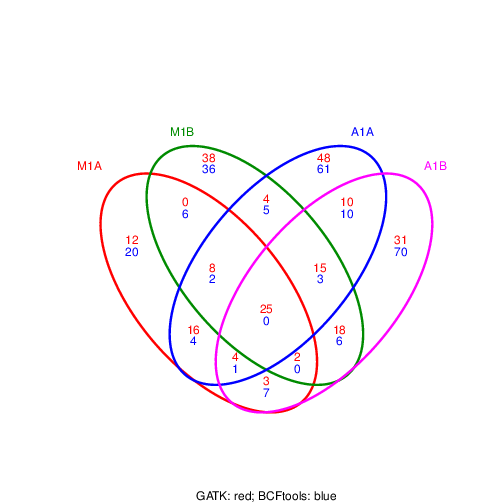
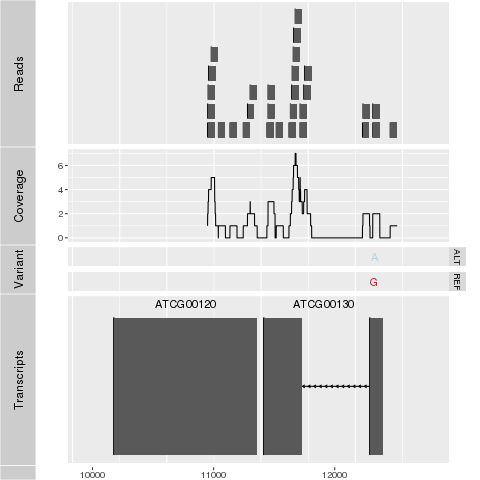

```{css, echo=FALSE}
pre code {
white-space: pre !important;
overflow-x: scroll !important;
word-break: keep-all !important;
word-wrap: initial !important;
}
```

<!--
- Compile from command-line
Rscript -e "rmarkdown::render('systemPipeVARseq.Rmd', c('BiocStyle::html_document'), clean=F); knitr::knit('systemPipeVARseq.Rmd', tangle=TRUE)"; Rscript ../md2jekyll.R systemPipeVARseq.knit.md 14; Rscript -e "rmarkdown::render('systemPipeVARseq.Rmd', c('BiocStyle::pdf_document'))"
-->

```{r style, echo = FALSE, results = 'asis'}
BiocStyle::markdown()
options(width=60, max.print=1000)
knitr::opts_chunk$set(
    eval=as.logical(Sys.getenv("KNITR_EVAL", "TRUE")),
    cache=as.logical(Sys.getenv("KNITR_CACHE", "TRUE")), 
    tidy.opts=list(width.cutoff=60), tidy=TRUE)
```

```{r setup, echo=FALSE, messages=FALSE, warnings=FALSE}
suppressPackageStartupMessages({
    library(systemPipeR)
    library(BiocParallel)
    library(Biostrings)
    library(Rsamtools)
    library(GenomicRanges)
    library(ggplot2)
    library(GenomicAlignments)
    library(ShortRead)
    library(ape)
    library(batchtools)
})
```

# Introduction

Users want to provide here background information about the design of their VAR-Seq project.

## Background and objectives

This report describes the analysis of a VAR-Seq project studying the
genetic differences among several strains ... from *organism* ....

## Experimental design

Typically, users want to specify here all information relevant for the
analysis of their NGS study. This includes detailed descriptions of
FASTQ files, experimental design, reference genome, gene annotations,
etc.

# Workflow environment

## Generate workflow environment

Load workflow environment with sample data into your current working
directory. The sample data are described
[here](http://www.bioconductor.org/packages/devel/bioc/vignettes/systemPipeR/inst/doc/systemPipeR.html#load-sample-data-and-workflow-templates).

```{r genVAR_workflow, eval=FALSE}
library(systemPipeRdata)
genWorkenvir(workflow="varseq")
setwd("varseq")
```

Alternatively, this can be done from the command-line as follows:

```{sh genVar_workflow_command_line, eval=FALSE}
Rscript -e "systemPipeRdata::genWorkenvir(workflow='varseq')"
```

In the workflow environments generated by `genWorkenvir` all data inputs are stored in
a `data/` directory and all analysis results will be written to a separate
`results/` directory, while the `systemPipeVARseq.Rmd` script and the `targets` file are expected to be located in the parent directory. The R session is expected to run from this parent
directory. Additional parameter files are stored under `param/`.

To work with real data, users want to organize their own data similarly
and substitute all test data for their own data. To rerun an established
workflow on new data, the initial `targets` file along with the corresponding
FASTQ files are usually the only inputs the user needs to provide.

## Run workflow

Now open the R markdown script `systemPipeVARseq.Rmd`in your R IDE (_e.g._ vim-r or RStudio) and 
run the workflow as outlined below. 

### Run R session on computer node

After opening the `Rmd` file of this workflow in Vim and attaching a connected
R session via the `F2` (or other) key, use the following command sequence to run your R
session on a computer node.

```{r closeR, eval=FALSE}
q("no") # closes R session on head node
```

```{bash node_environment, eval=FALSE}
srun --x11 --partition=short --mem=2gb --cpus-per-task 4 --ntasks 1 --time 2:00:00 --pty bash -l
module load R/3.4.2
R
```

Now check whether your R session is running on a computer node of the cluster and assess your environment.

```{r r_environment, eval=FALSE}
system("hostname") # should return name of a compute node starting with i or c 
getwd() # checks current working directory of R session
dir() # returns content of current working directory
```

The `systemPipeR` package needs to be loaded to perform the analysis steps shown in
this report [@H_Backman2016-bt].

```{r load_systempiper, eval=TRUE}
library(systemPipeR)
```

If applicable users can load custom functions not provided by `systemPipeR`. Skip
this step if this is not the case.

```{r load_custom_fct, eval=FALSE}
source("systemPipeVARseq_Fct.R")
```

# Read preprocessing

## Experiment definition provided by `targets` file

The `targets` file defines all FASTQ files and sample comparisons of the analysis workflow.

```{r load_targets_file, eval=TRUE}
targetspath <- system.file("extdata", "targetsPE.txt", package="systemPipeR")
targets <- read.delim(targetspath, comment.char = "#")
targets[1:4, 1:4]
```

## Read quality filtering and trimming

The following removes reads with low quality base calls (here Phred
scores below 20) from all FASTQ files.

```{r preprocess_reads, eval=FALSE}
args <- systemArgs(sysma="param/trimPE.param", mytargets="targetsPE.txt")[1:4] 
          # Note: subsetting!
filterFct <- function(fq, cutoff=20, Nexceptions=0) {
    qcount <- rowSums(as(quality(fq), "matrix") <= cutoff, na.rm=TRUE)
    fq[qcount <= Nexceptions] 
    # Retains reads where Phred scores are >= cutoff with N exceptions
}
preprocessReads(args=args, Fct="filterFct(fq, cutoff=20, Nexceptions=0)",
                batchsize=100000)
writeTargetsout(x=args, file="targets_PEtrim.txt", overwrite=TRUE)
```

## FASTQ quality report

The following `seeFastq` and `seeFastqPlot` functions generate and plot a series of 
useful quality statistics for a set of FASTQ files including per cycle quality box
plots, base proportions, base-level quality trends, relative k-mer
diversity, length and occurrence distribution of reads, number of reads
above quality cutoffs and mean quality distribution. The results are
written to a PDF file named `fastqReport.pdf`.

```{r fastq_report, eval=FALSE}
args <- systemArgs(sysma="param/tophat.param", mytargets="targets.txt")
fqlist <- seeFastq(fastq=infile1(args), batchsize=100000, klength=8)
pdf("./results/fastqReport.pdf", height=18, width=4*length(fqlist))
seeFastqPlot(fqlist)
dev.off()
``` 


<div align="center">Figure 1: FASTQ quality report for 18 samples</div></br>

# Alignments

## Read mapping with `BWA-MEM` 

The NGS reads of this project are aligned against the reference genome
sequence using the highly variant tolerant short read aligner `BWA-MEM`
[@Li2013-oy; @Li2009-oc]. The parameter settings of the aligner are
defined in the `bwa.param` file.

```{r load_sysargs, eval=FALSE}
args <- systemArgs(sysma="param/bwa.param", mytargets="targets.txt")
sysargs(args)[1] # Command-line parameters for first FASTQ file
```

Runs the alignments sequentially (_e.g._ on a single machine)

```{r bwa_serial, eval=FALSE}
moduleload(modules(args))
system("bwa index -a bwtsw ./data/tair10.fasta")
bampaths <- runCommandline(args=args)
writeTargetsout(x=args, file="targets_bam.txt", overwrite=TRUE)
```

Alternatively, the alignment jobs can be submitted to a compute cluster,
here using 72 CPU cores (18 `qsub` processes each with 4 CPU cores).

```{r bwa_parallel, eval=FALSE}
moduleload(modules(args))
system("bwa index -a bwtsw ./data/tair10.fasta")
resources <- list(walltime=120, ntasks=1, ncpus=cores(args), memory=1024) 
reg <- clusterRun(args, conffile = ".batchtools.conf.R", Njobs=18, template = "batchtools.slurm.tmpl", runid="01", resourceList=resources)
getStatus(reg=reg) 
waitForJobs(reg=reg) 
writeTargetsout(x=args, file="targets_bam.txt", overwrite=TRUE)
```

Check whether all BAM files have been created

```{r check_file_presence, eval=FALSE}
file.exists(outpaths(args))
```

## Read mapping with `gsnap` 

An alternative variant tolerant aligner is `gsnap` from the `gmapR` package
[@Wu2010-iq]. The following code shows how to run this aligner on
multiple nodes of a computer cluster that uses Torque as scheduler.

```{r gsnap_parallel, eval=FALSE}
library(gmapR); library(BiocParallel); library(batchtools)
args <- systemArgs(sysma="param/gsnap.param", mytargets="targetsPE.txt")
gmapGenome <- GmapGenome(systemPipeR::reference(args), directory="data", 
                         name="gmap_tair10chr", create=TRUE)
f <- function(x) {
    library(gmapR); library(systemPipeR)
    args <- systemArgs(sysma="param/gsnap.param", mytargets="targetsPE.txt")
    gmapGenome <- GmapGenome(reference(args), directory="data", name="gmap_tair10chr", create=FALSE)
    p <- GsnapParam(genome=gmapGenome, unique_only=TRUE, molecule="DNA", max_mismatches=3)
    o <- gsnap(input_a=infile1(args)[x], input_b=infile2(args)[x], params=p, output=outfile1(args)[x])
}
resources <- list(walltime=120, ntasks=1, ncpus=cores(args), memory=1024) 
param <- BatchtoolsParam(workers = 4, cluster = "slurm", template = "batchtools.slurm.tmpl", resources = resources)
d <- bplapply(seq(along=args), f,  BPPARAM = param)
writeTargetsout(x=args, file="targets_gsnap_bam.txt", overwrite=TRUE)
```

## Read and alignment stats

The following generates a summary table of the number of reads in each
sample and how many of them aligned to the reference.

```{r align_stats, eval=FALSE}
read_statsDF <- alignStats(args=args) 
write.table(read_statsDF, "results/alignStats.xls", row.names=FALSE, quote=FALSE, sep="\t")
```

## Create symbolic links for viewing BAM files in IGV

The `symLink2bam` function creates symbolic links to view the BAM alignment files in a
genome browser such as IGV. The corresponding URLs are written to a file
with a path specified under `urlfile`, here `IGVurl.txt`.

```{r symbolic_links, eval=FALSE}
symLink2bam(sysargs=args, htmldir=c("~/.html/", "projects/gen242/"), 
            urlbase="http://biocluster.ucr.edu/~tgirke/", 
            urlfile="./results/IGVurl.txt")
```

# Variant calling

The following performs variant calling with `GATK`, `BCFtools` and `VariantTools` 
in parallel mode on a compute cluster [@McKenna2010-ql; @Li2011-ll]. If a cluster is not
available, the `runCommandline` function can be used to run the variant calling with `GATK` 
and `BCFtools` for each sample sequentially on a single machine, or `callVariants` in case 
of `VariantTools`. Typically, the user would choose here only one variant caller rather
than running several ones.

## Variant calling with `GATK`

The following creates in the inital step a new `targets` file
(`targets_bam.txt`). The first column of this file gives the paths to
the BAM files created in the alignment step. The new targets file and the
parameter file `gatk.param` are used to create a new `SYSargs`
instance for running GATK. Since GATK involves many processing steps, it is
executed by a bash script `gatk_run.sh` where the user can specify the
detailed run parameters. All three files are expected to be located in the
current working directory. Samples files for `gatk.param` and
`gatk_run.sh` are available in the `param` subdirectory
provided by `systemPipeRdata`.

```{r run_gatk, eval=FALSE}
moduleload("picard/1.130"); moduleload("samtools/1.3")
system("picard CreateSequenceDictionary R=./data/tair10.fasta O=./data/tair10.dict")
system("samtools faidx data/tair10.fasta")
args <- systemArgs(sysma="param/gatk.param", mytargets="targets_bam.txt")
resources <- list(walltime=120, ntasks=1, ncpus=4, memory=1024) 
reg <- clusterRun(args, conffile = ".batchtools.conf.R", Njobs=18, template = "batchtools.slurm.tmpl", runid="01", resourceList=resources)
getStatus(reg=reg) 
waitForJobs(reg=reg) 
# unlink(outfile1(args), recursive = TRUE, force = TRUE)
writeTargetsout(x=args, file="targets_gatk.txt", overwrite=TRUE)
```

## Variant calling with `BCFtools`

The following runs the variant calling with `BCFtools`. This step requires
in the current working directory the parameter file `sambcf.param` and the bash script 
`sambcf_run.sh`.

```{r run_bcftools, eval=FALSE}
args <- systemArgs(sysma="param/sambcf.param", mytargets="targets_bam.txt")
resources <- list(walltime=120, ntasks=1, ncpus=4, memory=1024) 
reg <- clusterRun(args, conffile = ".batchtools.conf.R", Njobs=18, template = "batchtools.slurm.tmpl", runid="01", resourceList=resources)
getStatus(reg=reg) 
waitForJobs(reg=reg)  
# unlink(outfile1(args), recursive = TRUE, force = TRUE)
writeTargetsout(x=args, file="targets_sambcf.txt", overwrite=TRUE)
```

## Variant calling with `VariantTools`  

```{r run_varianttools, eval=FALSE}
library(gmapR); library(BiocParallel); library(batchtools)
args <- systemArgs(sysma="param/vartools.param", 
                   mytargets="targets_gsnap_bam.txt")
f <- function(x) {
    library(VariantTools); library(gmapR); library(systemPipeR)
    args <- systemArgs(sysma="param/vartools.param", mytargets="targets_gsnap_bam.txt")
    gmapGenome <- GmapGenome(systemPipeR::reference(args), directory="data", name="gmap_tair10chr", create=FALSE)
    tally.param <- TallyVariantsParam(gmapGenome, high_base_quality = 23L, indels = TRUE)
    bfl <- BamFileList(infile1(args)[x], index=character())
    var <- callVariants(bfl[[1]], tally.param)
    sampleNames(var) <- names(bfl)
    writeVcf(asVCF(var), outfile1(args)[x], index = TRUE)
}
resources <- list(walltime=120, ntasks=1, ncpus=cores(args), memory=1024) 
param <- BatchtoolsParam(workers = 4, cluster = "slurm", template = "batchtools.slurm.tmpl", resources = resources)
d <- bplapply(seq(along=args), f,  BPPARAM = param)
writeTargetsout(x=args, file="targets_vartools.txt", overwrite=TRUE)
```

## Inspect VCF file 

VCF files can be imported into R with the `readVcf` function. Both `VCF` and `VRanges` objects provide
convenient data structure for working with variant data (_e.g._ SNP quality filtering). 

```{r inspect_vcf, eval=FALSE}
library(VariantAnnotation)
args <- systemArgs(sysma="param/filter_gatk.param", mytargets="targets_gatk.txt")
vcf <- readVcf(infile1(args)[1], "A. thaliana")
vcf
vr <- as(vcf, "VRanges")
vr
```

# Filter variants

The function `filterVars` filters VCF files based on user definable
quality parameters. It sequentially imports each VCF file into R, applies the
filtering on an internally generated `VRanges` object and then writes
the results to a new subsetted VCF file. The filter parameters are passed on to
the corresponding argument as a character string. The function applies this
filter to the internally generated `VRanges` object using the standard
subsetting syntax for two dimensional objects such as: `vr[filter, ]`.
The parameter files (`filter_gatk.param`, `filter_sambcf.param` and 
`filter_vartools.param`), used in the filtering steps, define the paths to 
the input and output VCF files which are stored in new `SYSargs` instances.  

## Filter variants called by `GATK` 

The below example filters for variants that are supported by `>=x`
reads and >=80% of them support the called variants. In addition, all
variants need to pass `>=x` of the soft filters recorded in the VCF
files generated by GATK. Since the toy data used for this workflow is
very small, the chosen settings are unreasonabley relaxed. A more
reasonable filter setting is given in the line below (here commented
out).

```{r filter_gatk, eval=FALSE}
library(VariantAnnotation)
library(BBmisc) # Defines suppressAll()
args <- systemArgs(sysma="param/filter_gatk.param", mytargets="targets_gatk.txt")[1:4]
filter <- "totalDepth(vr) >= 2 & (altDepth(vr) / totalDepth(vr) >= 0.8) & rowSums(softFilterMatrix(vr))>=1"
# filter <- "totalDepth(vr) >= 20 & (altDepth(vr) / totalDepth(vr) >= 0.8) & rowSums(softFilterMatrix(vr))==6"
suppressAll(filterVars(args, filter, varcaller="gatk", organism="A. thaliana"))
writeTargetsout(x=args, file="targets_gatk_filtered.txt", overwrite=TRUE)
```

## Filter variants called by `BCFtools`  

The following shows how to filter the VCF files generated by `BCFtools` using
similar parameter settings as in the previous filtering of the GATK
results.

```{r filter_bcftools, eval=FALSE}
args <- systemArgs(sysma="param/filter_sambcf.param", mytargets="targets_sambcf.txt")[1:4]
filter <- "rowSums(vr) >= 2 & (rowSums(vr[,3:4])/rowSums(vr[,1:4]) >= 0.8)"
# filter <- "rowSums(vr) >= 20 & (rowSums(vr[,3:4])/rowSums(vr[,1:4]) >= 0.8)"
suppressAll(filterVars(args, filter, varcaller="bcftools", organism="A. thaliana"))
writeTargetsout(x=args, file="targets_sambcf_filtered.txt", overwrite=TRUE)
```

## Filter variants called by `VariantTools` 

The following shows how to filter the VCF files generated by `VariantTools` using
similar parameter settings as in the previous filtering of the GATK
results.

```{r filter_varianttools, eval=FALSE}
library(VariantAnnotation)
library(BBmisc) # Defines suppressAll()
args <- systemArgs(sysma="param/filter_vartools.param", mytargets="targets_vartools.txt")[1:4]
filter <- "(values(vr)$n.read.pos.ref + values(vr)$n.read.pos) >= 2 & (values(vr)$n.read.pos / (values(vr)$n.read.pos.ref + values(vr)$n.read.pos) >= 0.8)"
# filter <- "(values(vr)$n.read.pos.ref + values(vr)$n.read.pos) >= 20 & (values(vr)$n.read.pos / (values(vr)$n.read.pos.ref + values(vr)$n.read.pos) >= 0.8)"
filterVars(args, filter, varcaller="vartools", organism="A. thaliana")
writeTargetsout(x=args, file="targets_vartools_filtered.txt", overwrite=TRUE)
```

Check filtering outcome for one sample

```{r check_filter, eval=FALSE}
length(as(readVcf(infile1(args)[1], genome="Ath"), "VRanges")[,1])
length(as(readVcf(outpaths(args)[1], genome="Ath"), "VRanges")[,1])
```

# Annotate filtered variants

The function `variantReport` generates a variant report using
utilities provided by the `VariantAnnotation` package. The report for
each sample is written to a tabular file containing genomic context annotations
(_e.g._ coding or non-coding SNPs, amino acid changes, IDs of affected
genes, etc.) along with confidence statistics for each variant. The parameter
file `annotate_vars.param` defines the paths to the input and output
files which are stored in a new `SYSargs` instance. 

## Basics of annotating variants

Variants overlapping with common annotation features can be identified with `locateVariants`.
```{r annotate_basics, eval=FALSE}
library("GenomicFeatures")
args <- systemArgs(sysma="param/annotate_vars.param", mytargets="targets_gatk_filtered.txt")
txdb <- loadDb("./data/tair10.sqlite")
vcf <- readVcf(infile1(args)[1], "A. thaliana")
locateVariants(vcf, txdb, CodingVariants())
```

Synonymous/non-synonymous variants of coding sequences are computed by the predictCoding function for variants overlapping with coding regions.

```{r annotate_basics_non-synon, eval=FALSE}
fa <- FaFile(systemPipeR::reference(args))
predictCoding(vcf, txdb, seqSource=fa)
```

## Annotate filtered variants called by `GATK`

```{r annotate_gatk, eval=FALSE}
library("GenomicFeatures")
args <- systemArgs(sysma="param/annotate_vars.param", mytargets="targets_gatk_filtered.txt")
txdb <- loadDb("./data/tair10.sqlite")
fa <- FaFile(systemPipeR::reference(args))
suppressAll(variantReport(args=args, txdb=txdb, fa=fa, organism="A. thaliana"))
```

## Annotate filtered variants called by `BCFtools`

```{r annotate_bcftools, eval=FALSE}
args <- systemArgs(sysma="param/annotate_vars.param", mytargets="targets_sambcf_filtered.txt")
txdb <- loadDb("./data/tair10.sqlite")
fa <- FaFile(systemPipeR::reference(args))
suppressAll(variantReport(args=args, txdb=txdb, fa=fa, organism="A. thaliana"))
```

## Annotate filtered variants called by `VariantTools`

```{r annotate_varianttools, eval=FALSE}
args <- systemArgs(sysma="param/annotate_vars.param", mytargets="targets_vartools_filtered.txt")
txdb <- loadDb("./data/tair10.sqlite")
fa <- FaFile(systemPipeR::reference(args))
suppressAll(variantReport(args=args, txdb=txdb, fa=fa, organism="A. thaliana"))
```

View annotation result for single sample
```{r view_annotation, eval=FALSE}
read.delim(outpaths(args)[1])[38:40,]
```

# Combine annotation results among samples

To simplify comparisons among samples, the `combineVarReports`
function combines all variant annotation reports referenced in a
`SYSargs` instance (here `args`). At the same time the function
allows to consider only certain feature types of interest. For instance, the
below setting `filtercol=c(Consequence="nonsynonymous")` will include
only nonsysynonymous variances listed in the `Consequence` column of
the annotation reports. To omit filtering, one can use the setting
`filtercol="All"`.

## Combine results from `GATK`  

```{r combine_gatk, eval=FALSE}
args <- systemArgs(sysma="param/annotate_vars.param", mytargets="targets_gatk_filtered.txt")
combineDF <- combineVarReports(args, filtercol=c(Consequence="nonsynonymous"))
write.table(combineDF, "./results/combineDF_nonsyn_gatk.xls", quote=FALSE, row.names=FALSE, sep="\t")
```

## Combine results from `BCFtools`  

```{r combine_bcftools, eval=FALSE}
args <- systemArgs(sysma="param/annotate_vars.param", mytargets="targets_sambcf_filtered.txt")
combineDF <- combineVarReports(args, filtercol=c(Consequence="nonsynonymous"))
write.table(combineDF, "./results/combineDF_nonsyn_sambcf.xls", quote=FALSE, row.names=FALSE, sep="\t")
```

## Combine results from `VariantTools`

```{r combine_varianttools, eval=FALSE}
args <- systemArgs(sysma="param/annotate_vars.param", mytargets="targets_vartools_filtered.txt")
combineDF <- combineVarReports(args, filtercol=c(Consequence="nonsynonymous"))
write.table(combineDF, "./results/combineDF_nonsyn_vartools.xls", quote=FALSE, row.names=FALSE, sep="\t")
combineDF[2:4,] 
```

# Summary statistics of variants

The `varSummary` function counts the number of variants for each feature type
included in the anntation reports.

## Summary for `GATK`

```{r summary_gatk, eval=FALSE}
args <- systemArgs(sysma="param/annotate_vars.param", mytargets="targets_gatk_filtered.txt")
varSummary(args)
write.table(varSummary(args), "./results/variantStats_gatk.xls", quote=FALSE, col.names = NA, sep="\t")
```

## Summary for `BCFtools`

```{r summary_bcftools, eval=FALSE}
args <- systemArgs(sysma="param/annotate_vars.param", mytargets="targets_sambcf_filtered.txt")
varSummary(args)
write.table(varSummary(args), "./results/variantStats_sambcf.xls", quote=FALSE, col.names = NA, sep="\t")
```

## Summary for `VariantTools`  

```{r summary_varianttools, eval=FALSE}
args <- systemArgs(sysma="param/annotate_vars.param", mytargets="targets_vartools_filtered.txt")
varSummary(args)
write.table(varSummary(args), "./results/variantStats_vartools.xls", quote=FALSE, col.names = NA, sep="\t")
```

# Venn diagram of variants

The venn diagram utilities defined by the `systemPipeR` package can be used to
identify common and unique variants reported for different samples
and/or variant callers. The below generates a 4-way venn diagram
comparing four sampes for each of the two variant callers.

```{r venn_diagram, eval=FALSE}
args <- systemArgs(sysma="param/annotate_vars.param", mytargets="targets_gatk_filtered.txt")
varlist <- sapply(names(outpaths(args))[1:4], function(x) as.character(read.delim(outpaths(args)[x])$VARID))
vennset_gatk <- overLapper(varlist, type="vennsets")
args <- systemArgs(sysma="param/annotate_vars.param", mytargets="targets_sambcf_filtered.txt")
varlist <- sapply(names(outpaths(args))[1:4], function(x) as.character(read.delim(outpaths(args)[x])$VARID))
vennset_bcf <- overLapper(varlist, type="vennsets")
args <- systemArgs(sysma="param/annotate_vars.param", mytargets="targets_vartools_filtered.txt")
varlist <- sapply(names(outpaths(args))[1:4], function(x) as.character(read.delim(outpaths(args)[x])$VARID))
vennset_vartools <- overLapper(varlist, type="vennsets")
pdf("./results/vennplot_var.pdf")
vennPlot(list(vennset_gatk, vennset_bcf, vennset_vartools), mymain="", mysub="GATK: red; BCFtools: blue; VariantTools: green", colmode=2, ccol=c("red", "blue", "green"))
dev.off()
```


<div align="center">Figure 2: Venn Diagram for 4 samples from GATK and BCFtools</div></br>


# Plot variants programmatically 

The following plots a selected variant with `ggbio`.

```{r plot_variant, eval=FALSE}
library(ggbio)
mychr <- "ChrC"; mystart <- 11000; myend <- 13000
args <- systemArgs(sysma="param/bwa.param", mytargets="targets.txt")
ga <- readGAlignments(outpaths(args)[1], use.names=TRUE, param=ScanBamParam(which=GRanges(mychr, IRanges(mystart, myend))))
p1 <- autoplot(ga, geom = "rect")
p2 <- autoplot(ga, geom = "line", stat = "coverage")
p3 <- autoplot(vcf[seqnames(vcf)==mychr], type = "fixed") + 
                xlim(mystart, myend) + theme(legend.position = "none", 
                    axis.text.y = element_blank(), axis.ticks.y=element_blank())
p4 <- autoplot(txdb, which=GRanges(mychr, IRanges(mystart, myend)), names.expr = "gene_id")
png("./results/plot_variant.png")
tracks(Reads=p1, Coverage=p2, Variant=p3, Transcripts=p4, heights = c(0.3, 0.2, 0.1, 0.35)) + ylab("")
dev.off()
```


<div align="center">Figure 3: Plot variants with programmatically.</div></br>

# Version Information

```{r sessionInfo}
sessionInfo()
```

# Funding

This project was supported by funds from the National Institutes of
Health (NIH) and the National Science Foundation (NSF).

# References

